---
html:
  embed_local_images: true
  embed_svg: true
  offline: true
toc: false
---
Proceso de Estudio de Databricks: Data Analyst


- [Información Arquitectura General](#información-arquitectura-general)
- [Arquitectura Medallion](#arquitectura-medallion)
  - [Bronze (crudo).](#bronze-crudo)
  - [Silver (limpio/conformado).](#silver-limpioconformado)
  - [Gold (negocio/curado).](#gold-negociocurado)
- [Bronze : En detalle](#bronze--en-detalle)
  - [Append-only](#append-only)
    - [Hay dos "append-only" que conviene no confundir](#hay-dos-append-only-que-conviene-no-confundir)
  - [Payload](#payload)
  - [Metadato de control](#metadato-de-control)
  - [Schema enforcement](#schema-enforcement)
  - [COPY INTO](#copy-into)
- [Silver : En detalle](#silver--en-detalle)
  - [Limpieza y validación de tipos\*\*](#limpieza-y-validación-de-tipos)
  - [Manejo de valores faltantes](#manejo-de-valores-faltantes)
  - [Deduplicación](#deduplicación)
  - [Joins de conformación](#joins-de-conformación)
- [Gold : En detalle](#gold--en-detalle)
  - [Agregación](#agregación)
  - [Modelo Dimensional](#modelo-dimensional)
    - [Esquema Estrella](#esquema-estrella)
    - [Copo de Nieve](#copo-de-nieve)
    - [Data Vault](#data-vault)
  - [Galaxy / fact constellation](#galaxy--fact-constellation)
  - [Materialización para consumo](#materialización-para-consumo)
- [Databricks SQL / SQL Warehouses](#databricks-sql--sql-warehouses)
  - [SQL Warehouse](#sql-warehouse)
    - [Serveles](#serveles)
    - [Pro](#pro)
    - [Classic](#classic)
    - [Detalle de Tamaño](#detalle-de-tamaño)
    - [Detalle de Escalado](#detalle-de-escalado)
    - [Detalle del Auto-Stop](#detalle-del-auto-stop)
  - [Databricks Assistand](#databricks-assistand)
    - [/explain](#explain)
    - [/optimize](#optimize)
    - [/generate](#generate)
    - [/fix](#fix)
  - [Lakehouse Federation](#lakehouse-federation)
  - [Vistas y Tablas Especiales](#vistas-y-tablas-especiales)
    - [VIEW](#view)
    - [MATERIALIZED VIEW](#materialized-view)
    - [Streaming Table](#streaming-table)
    - [Dynamic View](#dynamic-view)
  - [Operaciones de Consulta](#operaciones-de-consulta)
    - [Joins](#joins)
    - [Operaciones de Conjunto](#operaciones-de-conjunto)
    - [Agregación](#agregación-1)
    - [Filtrar, ordenar y subconsultas](#filtrar-ordenar-y-subconsultas)
    - [Crear tablas uniendo fuentes](#crear-tablas-uniendo-fuentes)
  - [Managed vs. external tables](#managed-vs-external-tables)
    - [Managed vs External vs Volume + qué pasa al hacer DROP](#managed-vs-external-vs-volume--qué-pasa-al-hacer-drop)
    - [Tabla Managed](#tabla-managed)
    - [Tabla External](#tabla-external)
  - [Time travel](#time-travel)
    - [VERSION AS OF \<número\>](#version-as-of-número)
    - [TIMESTAMP AS OF '](#timestamp-as-of-)
- [Dashboards y Visualizaciones](#dashboards-y-visualizaciones)
  - [Procesos UI clave / Resumen](#procesos-ui-clave--resumen)
    - [Permisos de dashboard](#permisos-de-dashboard)
    - [Elegir la visualización correcta](#elegir-la-visualización-correcta)
    - [Ejemplo de estructura de código](#ejemplo-de-estructura-de-código)
  - [AI/BI Dashboards](#aibi-dashboards)
  - [Visualizaciones](#visualizaciones)
    - [SQL Editor](#sql-editor)
    - [Notebooks](#notebooks)
  - [Parámetros](#parámetros)
  - [Permisos y Compartir](#permisos-y-compartir)
    - [Usuarios y grupos del workspace](#usuarios-y-grupos-del-workspace)
    - [Enlace compartible](#enlace-compartible)
    - [Embebido en apps externas](#embebido-en-apps-externas)
  - [Scheduled Refresh](#scheduled-refresh)
  - [Alerts](#alerts)
  - [Dashboards](#dashboards)
    - [Bar](#bar)
    - [Line](#line)
    - [Pie](#pie)
    - [Scatter](#scatter)
    - [Counter](#counter)
    - [Pivot table](#pivot-table)
    - [Histogram](#histogram)
- [Analizar consultas](#analizar-consultas)
  - [Photon](#photon)
  - [Encontrar consultas lentas](#encontrar-consultas-lentas)
    - [Query History](#query-history)
    - [Query Profile](#query-profile)
    - [Query Insights](#query-insights)
  - [Caching](#caching)
    - [Result Cache](#result-cache)
    - [Disk Cache](#disk-cache)
  - [Liquid Clustering](#liquid-clustering)
  - [Fix a Query](#fix-a-query)
    - [GROUP BY](#group-by)
    - [Filtrar un agregado con WHERE](#filtrar-un-agregado-con-where)
    - [Comparar con NULL usando](#comparar-con-null-usando)
    - [Conteo inflado por duplicados o por un join](#conteo-inflado-por-duplicados-o-por-un-join)
    - [Orden lógico mal entendido](#orden-lógico-mal-entendido)
- [Genie](#genie)
  - [Qué es Genie y sus componentes](#qué-es-genie-y-sus-componentes)
    - [SQL Warehouse](#sql-warehouse-1)
    - [Datasets curados de Unity Catalog](#datasets-curados-de-unity-catalog)
    - [Sample questions](#sample-questions)
    - [Instrucciones de dominio](#instrucciones-de-dominio)
    - [Trusted Assets](#trusted-assets)
  - [Permisos y Distribución](#permisos-y-distribución)
    - [Permisos](#permisos)
    - [Distribución](#distribución)
  - [Optimización / Mantenimiento](#optimización--mantenimiento)
    - [Monitorear el uso real](#monitorear-el-uso-real)
    - [Refinar instrucciones y Trusted Assets](#refinar-instrucciones-y-trusted-assets)
    - [Validar con benchmarks](#validar-con-benchmarks)
    - [Refrescar los metadatos de Unity Catalog](#refrescar-los-metadatos-de-unity-catalog)
- [Plataforma Databricks](#plataforma-databricks)
  - [Los componentes núcleo](#los-componentes-núcleo)
    - [Delta Lake](#delta-lake)
    - [Unity Catalog](#unity-catalog)
    - [Databricks SQL](#databricks-sql)
    - [Photon](#photon-1)
    - [Mosaic AI](#mosaic-ai)
    - [Delta Live Tables](#delta-live-tables)
    - [Lakeflow Jobs](#lakeflow-jobs)
    - [Data Intelligence Engine](#data-intelligence-engine)
  - [Catalog Explorer](#catalog-explorer)
  - [Marketplace y Partner Connect](#marketplace-y-partner-connect)
    - [Databricks Marketplace](#databricks-marketplace)
    - [Partner Connect](#partner-connect)
- [Asegurar Datos](#asegurar-datos)
  - [Roles, privilegios y propiedad](#roles-privilegios-y-propiedad)
  - [Proteger PII](#proteger-pii)
    - [Column masks](#column-masks)
    - [Row filters](#row-filters)
    - [Dynamic views](#dynamic-views)
    - [Tags + ABAC](#tags--abac)
  - [Auditoría](#auditoría)
    - [audit logs](#audit-logs)
    - [system tables](#system-tables)
- [Managing Data](#managing-data)
  - [Descubrir y consumir datasets certificados](#descubrir-y-consumir-datasets-certificados)
  - [Etiquetar y linaje](#etiquetar-y-linaje)
  - [Limpieza en SQL](#limpieza-en-sql)
- [Resumen](#resumen)
  - [Section 1: Understanding of Databricks Data Intelligence Platform](#section-1-understanding-of-databricks-data-intelligence-platform)
  - [Section 2: Managing Data](#section-2-managing-data)
  - [Section 3: Importing Data](#section-3-importing-data)
  - [Section 4: Executing queries using Databricks SQL and Databricks SQL Warehouses](#section-4-executing-queries-using-databricks-sql-and-databricks-sql-warehouses)
  - [Section 5: Analyzing Queries](#section-5-analyzing-queries)
  - [Section 6: Working with Dashboards and Visualizations in Databricks](#section-6-working-with-dashboards-and-visualizations-in-databricks)
  - [Section 7: Developing, Sharing, and Maintaining AI/BI Genie spaces](#section-7-developing-sharing-and-maintaining-aibi-genie-spaces)
  - [Section 8: Data Modeling with Databricks SQL](#section-8-data-modeling-with-databricks-sql)
  - [Section 9: Securing Data](#section-9-securing-data)
- [Ejemplos de código - SQL](#ejemplos-de-código---sql)
  - [Agregación y nulos](#agregación-y-nulos)
  - [Joins, conjuntos, dedup y cast](#joins-conjuntos-dedup-y-cast)
  - [Ingesta y tablas](#ingesta-y-tablas)
  - [Vistas, parámetros, permisos y PII](#vistas-parámetros-permisos-y-pii)


# Información Arquitectura General

* Existe la arquitectura de Databricks como herramienta y existe la arquitectura del proceso de datos como tal.

* Con respecto a la arquitectura de Databricks, es importante recalcar que es la fusión de otras estructuras ya establecidas. Justo esa es la ventaja y propiedad importante con su sistema.
* Databricks es un ```Lakehouse```, que combina lo abierto de un ```Data Lake``` con la fiabilidad y velocidad de un ```Data Werehouse```.
* El almacenamiento es ```Delta Lake```. Que es un formato abierto sobre ```Parquet``` que añade ```transacciones ACID```, ```time travel``` e ```historial```. 
* El cómputo para analistas es el ```SQL Warehouse```, acelerado por ```Photon``` (motor vectorizado en C++ que hace correr el SQL mucho más rápido). 
* Por encima de todo está ```Unity Catalog```, la capa de gobierno: controla permisos, linaje, y organiza todo en el 3-level namespace Catálogo → Esquema → Tabla/Volumen.
* La ventaja clave que el examen quiere que entiendas: un solo lugar gobierna datos, accesos y linaje, sin mover los datos a otra herramienta.
  
# Arquitectura Medallion

El Estado de Madurez del Dato

* La metáfora de los metales es literal: el bronce es crudo, la plata está pulida, el oro está listo para entregar.
  
## Bronze (crudo). 

Para qué sirve: 

* Es la zona de aterrizaje. 
* Recibe el dato exactamente como llega de la fuente, normalmente en ```modo append-only``` (solo se agrega, no se modifica), conservando todo el historial. 
* Aquí entran los métodos de ingesta: ```Auto Loader, ingesta desde S3, Delta Sharing, intake por API, carga por la UI y el Marketplace```. 
* Esta sección es de lectura de pistas. Asóciala así:

"Archivos llegan continuamente + schema evolution" → Auto Loader.
"Cargar solo lo nuevo de una carpeta, vía SQL, repetible" → COPY INTO.
"Compartir entre organizaciones sin copiar" → Delta Sharing.
"Datos de terceros gobernados, sin ETL ni replicación" → Marketplace (que va sobre Delta Sharing).
"Subir un archivo pequeño manual" → UI Upload (va a DBFS, luego COPY INTO).
"Unir Delta con MySQL/Snowflake sin copiar" → Lakehouse Federation (foreign catalog).

> El distractor frecuente: mezclan Auto Loader con COPY INTO. La diferencia es streaming/continuo (Auto Loader) vs batch SQL idempotente (COPY INTO).
  
Su ventaja: 

* Su gran ventaja es que preserva la fuente original, así que si una transformación sale mal, puedes reprocesar desde cero. 
  
Sus limitantes: 

* El dato está sucio (duplicados, nulos, formatos inconsistentes), no está pensado para consultas de análisis, y un analista normalmente no construye dashboards directamente sobre Bronze.
  
## Silver (limpio/conformado). 

Para qué sirve: 
  
* Aquí se limpia, se deduplica, se validan tipos y se hacen los joins que unifican varias fuentes en una vista coherente de cada entidad del negocio (clientes, pedidos, productos). 
* Es la capa donde aplican las operaciones de limpieza (removing invalid data, manejo de valores faltantes). 
  
Su ventaja: 

* Ya es consultable y confiable, y sirve tanto a analistas como a ciencia de datos. 
  
Sus limitantes: 

* Sigue siendo muy granular y a menudo demasiado detallada o normalizada para un reporte directo; todavía requiere agregación para que un dashboard rinda bien.

## Gold (negocio/curado). 

Para qué sirve: 

* Tablas agregadas y orientadas a un caso de uso concreto, ya modeladas para análisis. Aquí se aplican modelos ```estrella (star)```, ```copo de nieve (snowflake)``` o ```data vault```.
* Gold es la capa que se alinea con ```BI```. Es donde el analista pasa la mayor parte del tiempo: ```dashboards AI/BI, espacios Genie, consultas en el SQL Editor, vistas materializadas```. 
  
Su ventaja: 

* Rápida, lista para el negocio, fácil de consumir. 
  
Sus limitantes:

* Pierde granularidad (es agregada, así que no sirve para ```drill-down``` arbitrario), está hecha a la medida de ciertas preguntas, y tiene latencia de refresco (no es tiempo real salvo que uses Streaming Tables).


**Lo que más importa para la certificación**

- Para el examen de Data Analyst, interioriza esto: tú vives en Silver y Gold, no en Bronze. Tu trabajo es consultar certified datasets (datasets certificados, ya curados por ingenieros), analizarlos y construir dashboards y espacios Genie sobre ellos. La pregunta típica de modelado te pedirá relacionar el esquema estrella con la capa Gold y la Medallion, no construir los pipelines de ingesta (eso es más del rol de Data Engineer).

- La capa Bronze es la zona de aterrizaje del dato: el primer lugar donde cae la información cuando entra a Databricks, y se guarda exactamente como llegó de la fuente, sin limpiar ni transformar. Lo único que normalmente se le agrega son metadatos de control (la marca de tiempo de ingesta, el nombre del archivo o sistema de origen), pero el contenido en sí queda intacto. Es además, casi siempre, una zona ```append-only```: solo se agregan registros nuevos, nunca se sobrescriben los anteriores.

La pregunta de fondo ```¿por qué guardar el dato crudo en lugar de limpiarlo de una vez?``` tiene varias razones que conviene tener claras:

1. La principal es el reprocesamiento. Si mañana descubres un error en la lógica de limpieza, o cambian las reglas del negocio, puedes reconstruir Silver y Gold desde Bronze sin volver a pedirle nada a la fuente original. Esto importa mucho porque la fuente a veces ya no está disponible, es cara de consultar, o peor: pudo haber cambiado o borrado esos datos. Bronze es tu red de seguridad.
2. La auditoría y trazabilidad. Bronze es el registro fiel de qué se recibió y cuándo. Si alguien cuestiona un número en un dashboard, puedes rastrear hacia atrás hasta el dato original tal como entró. Esto se apoya en el time travel y el historial de Delta Lake, que te dejan consultar versiones pasadas de la tabla.

3. También está el desacople: separar la ingesta de la transformación. Si un proceso de limpieza se rompe, no perdiste nada, porque el dato crudo ya está a salvo en Bronze. Y por último, la evolución de esquema: capturas todo lo que llega, incluso campos que hoy no usas pero que podrías necesitar después; si los descartaras en la ingesta, esa información se perdería para siempre.

4. No construyes análisis sobre Bronze. El dato ahí está sucio (duplicados, nulos, formatos inconsistentes) y no está pensado para consultas. 
5. Lo que el examen quiere que reconozcas es que Bronze existe y para qué sirve, ```preservar la fuente cruda para poder reprocesar y auditar```, mientras que el trabajo del analista vive en Silver y Gold. 
6. La ingesta hacia Bronze suele hacerse con ```Auto Loader``` (que detecta y carga archivos nuevos de forma incremental).
7.  Si Bronze intentara forzar tipos en la ingesta, un registro malformado rompería la carga y perderías datos; al aceptarlo todo como viene, garantizas que nada se cae en la entrada.

.png>)


# Bronze : En detalle

## Append-only
* Se traduce como "solo se anexa". En una tabla ```append-only``` la única operación permitida es agregar filas nuevas. 
* Nunca se modifica una fila que ya existe (UPDATE) ni se borra (DELETE).
*  Si llega información corregida de la fuente, no se "pisa" el registro viejo: se agrega un registro nuevo, y los dos conviven. El dato, una vez escrito, queda inmutable.

>Compáralo con cómo trabaja una base de datos transaccional normal: 

>Si un cliente cambia de correo, ahí harías un UPDATE y el correo viejo desaparece. En Bronze no; el correo viejo se queda, y el nuevo se anexa.

>Por eso Bronze es un registro histórico fiel de todo lo que entró y cuándo.

### Hay dos "append-only" que conviene no confundir

1. El ```append-only``` como patrón de ingesta (decisión de diseño). Tú decides que a Bronze solo se le anexa. Es una disciplina: "aquí no limpio, no corrijo, no borro; solo acumulo".
   
2. El ```append-only``` como propiedad del almacenamiento de ```Delta Lake``` (cómo funciona por dentro). ```Delta Lake``` nunca edita un archivo Parquet en su lugar. Cuando algo cambia, escribe archivos nuevos y anota la operación en el transaction log creando una versión nueva de la tabla. Es decir, el motor por debajo ya es inmutable/append por naturaleza.
Bronze se apoya en el punto 2 para que el punto 1 sea barato y seguro. Como cada escritura genera una versión nueva sin tocar las anteriores, anexar es la operación más natural y eficiente que existe en ```Delta```.

**Por qué Bronze elige esta propiedad (las consecuencias)**

Que sea append-only no es un capricho; habilita las ventajas que ya vimos de Bronze:

- Time travel real. Como cada ingesta deja una versión (v1, v2, v3...), puedo consultar la tabla como estaba antes: 
```sql
SELECT * FROM bronze.ventas VERSION AS OF 7
``` 
  Esto solo es posible porque nada se sobreescribió.
- Auditoría. DESCRIBE HISTORY bronze.ventas me muestra cada operación de escritura (verás que son WRITE/APPEND, no UPDATE). Puedo rastrear qué entró y cuándo.
- Reprocesamiento. Como el crudo está intacto, puedo reconstruir Silver y Gold desde cero si cambio la lógica.

- Cero pérdida en la entrada. Anexar nunca destruye nada, así que un error de proceso no borra datos buenos.

Delta tiene una propiedad que fuerza este comportamiento, por si quieres una garantía y no solo una disciplina:

```sql
ALTER TABLE bronze.ventas SET TBLPROPERTIES (delta.appendOnly = true);
```

Con ```delta.appendOnly = true```, la tabla rechaza cualquier UPDATE o DELETE: solo deja INSERT/append. Es la barrera que convierte "yo prometo no modificar" en "el sistema no me deja modificar".

**¿Por qué Bronze tiene dato sucio?
**
- Si Bronze solo anexa y nunca corrige, entonces los duplicados, los nulos y los formatos malos se acumulan a propósito. ```Append-only``` y "dato sucio" son dos caras de la misma moneda.
- La limpieza y la deduplicación no ocurren aquí, ocurren en Silver. Si la fuente manda el mismo pedido dos veces, en Bronze tendrás el pedido dos veces, y está bien que así sea.
- Y conecta con la ingesta: el streaming y ```Auto Loader``` son append por naturaleza (cada archivo o fila nueva se procesa una sola vez y se anexa). Por eso el patrón canónico es ```Auto Loader → Bronze```: la herramienta de ingesta y la propiedad de la capa encajan perfecto.

> Bronze es append-only porque su trabajo es preservar el dato crudo inmutable para auditar y reprocesar; por eso acumula historial completo (y dato sucio), y la limpieza se delega a Silver.

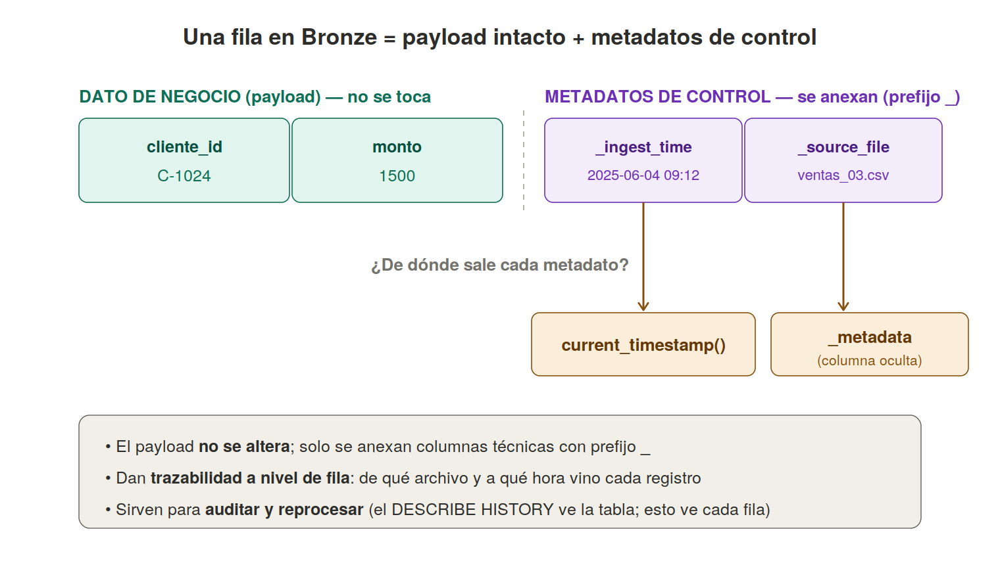


## Payload
-  El payload no se altera; Bronze solo anexa columnas técnicas con prefijo:
```sql
_ (hora de ingesta vía current_timestamp(), archivo/sistema de origen vía la columna oculta _metadata)
``` 

- Esto dan trazabilidad a nivel de fila para auditar y reprocesar.


## Metadato de control

- Los metadatos de control son lo único que sí se le agrega al dato, y describen cómo y de dónde llegó, nunca qué dice.


## Schema enforcement

- Rechaza cualquier escritura que no calce con la estructura definida. Eso es bueno para la calidad, pero rígido. 
- El problema es que las fuentes mutan: hoy un archivo de ventas trae cinco columnas y mañana el sistema origen agrega una sexta (```canal_venta```, por ejemplo). Con solo el refuerzo de esquema, esa carga nueva fallaría. Y para Bronze, fallar en la entrada o rechazar datos contradice su razón de ser.
- La evolución de esquema es justamente el mecanismo controlado que permite que el esquema de la tabla crezca para acomodar columnas nuevas sin que tengas que redefinir la tabla a mano. 
- Cuando llega esa sexquinta columna, en vez de romperse, la tabla la incorpora.

> El enforcement protege contra cambios no deseados, y la evolution permite los cambios deseados. Bronze se apoya en Delta Lake, que soporta ambas.

- En la práctica, esto no es automático en cualquier escritura: se habilita explícitamente. La forma típica es la opción ```mergeSchema``` al escribir (que fusiona el esquema entrante con el existente), o en una operación de upsert, ```MERGE ... WITH SCHEMA EVOLUTION```. 
- Donde sí viene "de fábrica" es con ```Auto Loader```: por su modo de evolución de esquema, al detectar una columna nueva la añade automáticamente (y reinicia el flujo para tomar el esquema actualizado). Por eso el patrón canónico ```Auto Loader → Bronze``` maneja tan bien las fuentes cambiantes.
- La evolución de esquema y la columna ```_rescued_data``` son dos respuestas a la misma situación. Que llegue algo que el esquema no esperaba, pero con distinta política, la evolución de esquema dice "acomódalo, agrega la columna"; el rescate dice "apártalo en ```_rescued_data``` para revisarlo después".
- El ```_rescued_data``` suele ser el detector temprano: cuando ves que muchos registros traen consistentemente un campo rescatado que sí te interesa, esa es la señal para dejar que el esquema evolucione y lo absorba como columna propia. La decisión final, evolucionar o rescatar, depende de cuánto control quieras sobre los cambios.
- La evolución de esquema es la capacidad de ```Delta Lake``` (automática con ```Auto Loader```, o vía mergeSchema) de que la tabla crezca para absorber columnas nuevas de la fuente sin romperse, complementando al schema enforcement; es lo que permite a Bronze adaptarse a fuentes cambiantes sin perder datos.

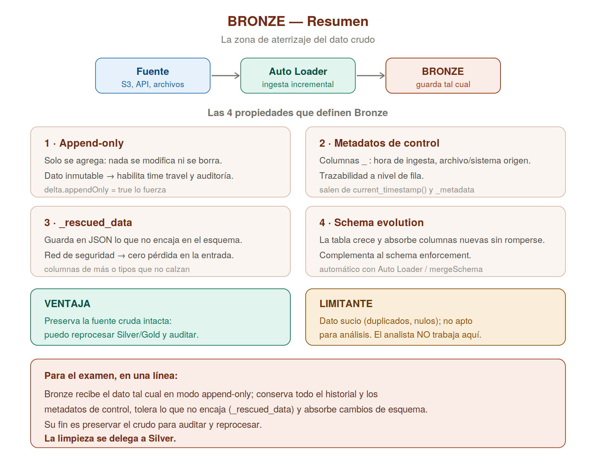

## COPY INTO

- Cuando ingieres archivos a una tabla, lo haces muchas veces a lo largo del tiempo: hoy llegan tres archivos, mañana dos más, y así. La pregunta peligrosa es: ```¿qué pasa si vuelvo a correr la carga y algunos de esos archivos ya los había cargado antes?``` En una ingesta ingenua, los volverías a leer y terminarías con filas duplicadas. Y eso, en Bronze, sería un desastre silencioso, porque Bronze es ```append-only```: no corrige duplicados, los acumula.
- Aquí entra la idempotencia. ```"Idempotente"``` significa que ejecutar la operación una vez o varias veces produce el mismo resultado: correrla de nuevo no agrega nada nuevo si no hay nada nuevo. 
- ```COPY INTO es idempotente``` por diseño porque lleva un registro interno de qué archivos ya cargó. Cuando lo ejecutas, mira la carpeta de origen, compara contra esa lista y solo procesa los archivos que no había visto antes. Los ya cargados los ignora. 
- Por eso puedes correr el mismo ```COPY INTO``` mil veces seguidas y, si no llegaron archivos nuevos, no pasa nada: cero duplicados.

**La forma típica es así:**

```sql
COPY INTO bronze.ventas
FROM 's3://bucket/ventas/'
FILEFORMAT = CSV
FORMAT_OPTIONS ('header' = 'true');
```

- ```COPY INTO``` es la carga incremental e idempotente de archivos hacia una tabla Delta existente; recuerda qué archivos ya procesó y solo ingiere los nuevos, así que reejecutarlo no duplica datos (a nivel de archivo, no de fila, eso es MERGE), y en modo batch frente al ```Auto Loader``` que es continuo.

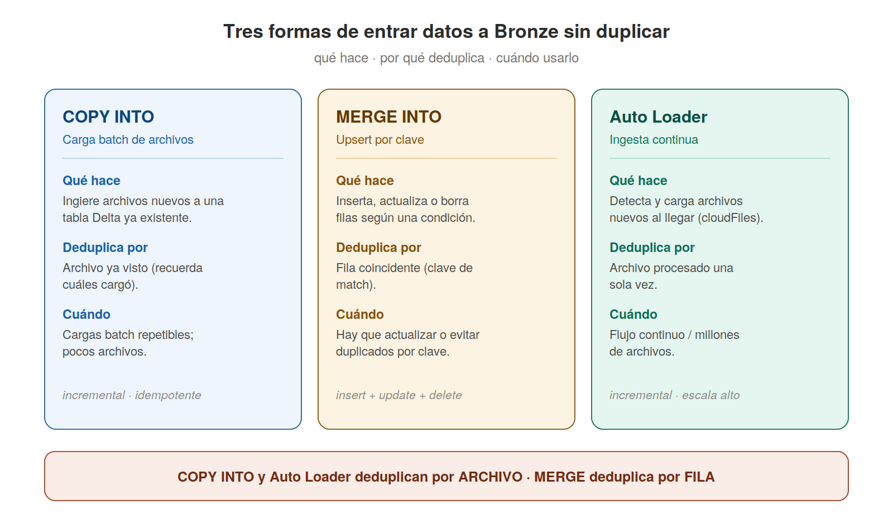


# Silver : En detalle

- Silver es **"dejar el dato limpio y confiable"**. Es la capa donde por fin se toca el dato para corregirlo, y donde el analista ya puede empezar a trabajar.

Silver tiene esencialmente cuatro trabajos:

1. La **limpieza y validación de tipos**: castear los textos crudos a su tipo real (`DATE`, `INT`, `DECIMAL`) y descartar o corregir lo que no calza. Es el espejo exacto de lo que Bronze deliberadamente *no* hacía.

2. El **manejo de valores faltantes** (nulos): decidir qué hacer con los huecos (rellenar, descartar la fila, o dejar un valor por defecto) según lo que el negocio necesite.
   
3. La **deduplicación**: quitar las filas repetidas que Bronze acumuló a propósito, para que cada entidad aparezca una sola vez.
   
4. Los **joins de conformación**: unir varias fuentes de Bronze en una vista coherente de cada entidad del negocio (un solo "cliente", un solo "pedido"), que es de donde sale el nombre *capa conformada*.

>El resultado de los cuatro es lo que define a Silver: un dato **consultable y confiable**, aunque todavía granular (esa es su limitante, la agregación para reportes llega hasta Gold).

## Limpieza y validación de tipos**

- Es la razón de ser de Silver.

- En Bronze, recordarás, todo entraba como **texto o tipos genéricos** para que ningún registro malformado rompiera la carga. El costo de esa tolerancia es que el dato crudo no es confiable para calcular: no puedes sumar montos que están guardados como texto, ni ordenar fechas que en realidad son cadenas. Silver paga esa deuda. Su trabajo de validación de tipos es **convertir cada columna a su tipo correcto** y, en el proceso, separar lo válido de lo inválido.

- La herramienta central es el **casteo** (`CAST`), que convierte un valor de un tipo a otro: 

```sql
CAST(monto AS DECIMAL(10,2))`, `CAST(fecha_txt AS DATE) 
```
## Manejo de valores faltantes
- **¿qué pasa si un valor no se puede convertir?** Por ejemplo, la palabra "N/D" en una columna que quieres pasar a número. Hay dos comportamientos posibles y conviene tenerlos claros:

`CAST` "duro" falla o produce error/null según el caso, lo que puede cortar el proceso. Por eso Databricks ofrece **`TRY_CAST`**, que intenta la conversión y, si no puede, devuelve `NULL` **sin romper** la consulta. 

>Esa diferencia es clave: 
`TRY_CAST` te permite procesar todo el lote, convertir lo convertible, y dejar como nulo lo que no calzaba para tratarlo después. Es la herramienta segura para validar tipos sobre datos sucios.

La validación, además, no es solo cambiar el tipo: es también **filtrar lo inválido**. Aquí entra la limpieza propiamente dicha: quitar filas con datos imposibles (un monto negativo donde no debería, una fecha del año 3000), recortar espacios con `TRIM`, normalizar mayúsculas con `UPPER`/`LOWER`, estandarizar formatos. Todo lo que en Bronze se dejó pasar "tal cual", en Silver se endereza.

Y conecta de forma directa con dos cosas de Bronze. 

1. Con `_rescued_data`: lo que en Bronze quedó apartado por no encajar en el esquema, **en Silver se decide qué hacer con ello** (recuperarlo, mapearlo, descartarlo). 
   
2. Con la garantía de no perder datos: como el crudo sigue intacto en Bronze, si tu lógica de casteo resulta estar mal, puedes corregirla y **reprocesar Silver desde cero** sin haber perdido nada. Silver es, en ese sentido, una capa que puedes "rehacer" cuantas veces necesites.

> La validación de tipos en Silver convierte el dato crudo (texto) a su tipo real con `CAST`/`TRY_CAST`. Usando `TRY_CAST` para no romper ante valores inválidos, que quedan en `NULL`, y filtra lo inválido; es el trabajo que Bronze deliberadamente no hacía y lo que vuelve a Silver confiable para análisis.


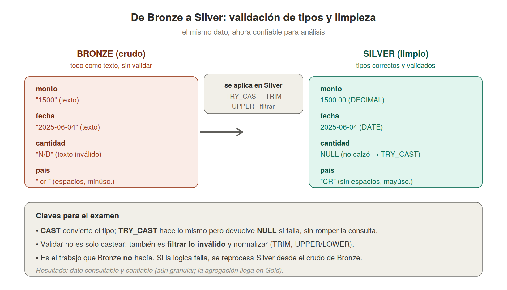

## Deduplicación
3. El duplicado exacto es una fila idéntica a otra en todas sus columnas. Aquí la solución es simple: `DISTINCT` (o un GROUP BY por todas las columnas) colapsa las filas repetidas en una sola `SELECT DISTINCT * FROM ...`.

El patrón canónico para esto es una función de ventana: `ROW_NUMBER()`. La idea es numerar las filas dentro de cada grupo y quedarte solo con la número 1. Se ve así:

```sql
SELECT * FROM (
  SELECT *,
    ROW_NUMBER() OVER (
      PARTITION BY pedido_id      -- agrupa por la clave de negocio
      ORDER BY _ingest_time DESC  -- ordena: la más reciente primero
    ) AS rn
  FROM bronze.pedidos
)
WHERE rn = 1;                     -- se queda solo con la más reciente
```

- `PARTITION BY pedido_id` arma un grupo por cada pedido; `ORDER BY _ingest_time DESC` ordena dentro del grupo poniendo la versión más nueva arriba; `ROW_NUMBER()` les pone 1, 2, 3...; y `WHERE rn = 1` se queda con la primera de cada grupo, es decir, la más reciente. Fíjate que aquí reaparece el `_ingest_time` que viste en los metadatos de control de Bronze: ese metadato es justo lo que te permite saber cuál versión es la última.

- `GROUP BY` también deduplica, pero te obliga a decidir un agregado por columna (te quedas con `MAX`, `MIN`, etc.), así que sirve cuando quieres resumir, no cuando quieres conservar la fila completa más reciente. La cláusula `QUALIFY` es un atajo de Databricks/SQL que filtra directamente sobre la función de ventana sin necesidad de la subconsulta (... `QUALIFY ROW_NUMBER() OVER (...) = 1`). Y existe `dropDuplicates` en el mundo de DataFrames,

>  Deduplicar en Silver quita las filas repetidas que Bronze acumuló; `DISTINCT` resuelve los duplicados exactos, y para quedarse con una sola versión por clave de negocio (la más reciente) el patrón es `ROW_NUMBER() OVER (PARTITION BY clave ORDER BY fecha DESC) filtrando = 1`

## Joins de conformación
4. Conformar es unir esas piezas en una vista coherente de cada entidad, para que "un cliente" o "un pedido" sea una sola cosa completa y no fragmentos sueltos. Ese es el trabajo del join aquí.
   
**Tipos:**

- INNER JOIN se queda solo con las filas que coinciden en ambas tablas. Riesgo: si un pedido no tiene cliente en la tabla de clientes, ese pedido desaparece. Útil cuando solo te interesa lo que casa en ambos lados.
LEFT JOIN conserva todo lo de la tabla izquierda y agrega lo que coincida de la derecha (lo que no coincide queda en NULL). Es el más usado al conformar, porque normalmente no quieres perder filas de tu tabla principal: traes todos los pedidos y les pegas los datos del cliente cuando existan.
FULL OUTER JOIN conserva todo de ambos lados. Sirve para no perder nada de ninguna de las dos tablas. se queda solo con las filas que coinciden en ambas tablas. Riesgo: si un pedido no tiene cliente en la tabla de clientes, ese pedido desaparece. Útil cuando solo te interesa lo que casa en ambos lados.
  
- **LEFT JOIN** conserva todo lo de la tabla izquierda y agrega lo que coincida de la derecha (lo que no coincide queda en NULL). Es el más usado al conformar, porque normalmente no quieres perder filas de tu tabla principal: traes todos los pedidos y les pegas los datos del cliente cuando existan.
  
- **FULL OUTER JOIN** conserva todo de ambos lados. Sirve para no perder nada de ninguna de las dos tablas.


> INNER puede hacerte perder filas; 
> LEFT las preserva.

Hay dos detalles técnicos del join que conviene tener fichados porque alteran el conteo de filas, y los conté inflados es un error clásico:

- El `fan-out` (explosión de filas): si la clave del join no es única en el lado derecho, una fila de la izquierda se multiplica por cada coincidencia. Si haces join de pedidos contra una tabla de precios que tiene el mismo producto repetido, cada pedido se duplica. Por eso deduplicar (el ladrillo anterior) va antes del join: unir tablas con duplicados propaga el problema.
  
- Las claves múltiples: muchas veces la entidad se identifica por más de una columna `(ON a.pedido_id = b.pedido_id AND a.linea = b.linea)`. Conformar bien exige unir por la clave completa, no por una parte.

> El resultado de conformar es una vista única, limpia y coherente de cada entidad del negocio, clientes, pedidos, productos, etc.. ya consultable y confiable. Esa es exactamente la definición de Silver. Lo que no hace todavía es agregar para reportes (sumar ventas por región, por mes): eso es granularidad de negocio y vive en Gold. Silver te entrega el detalle limpio; Gold lo resume.

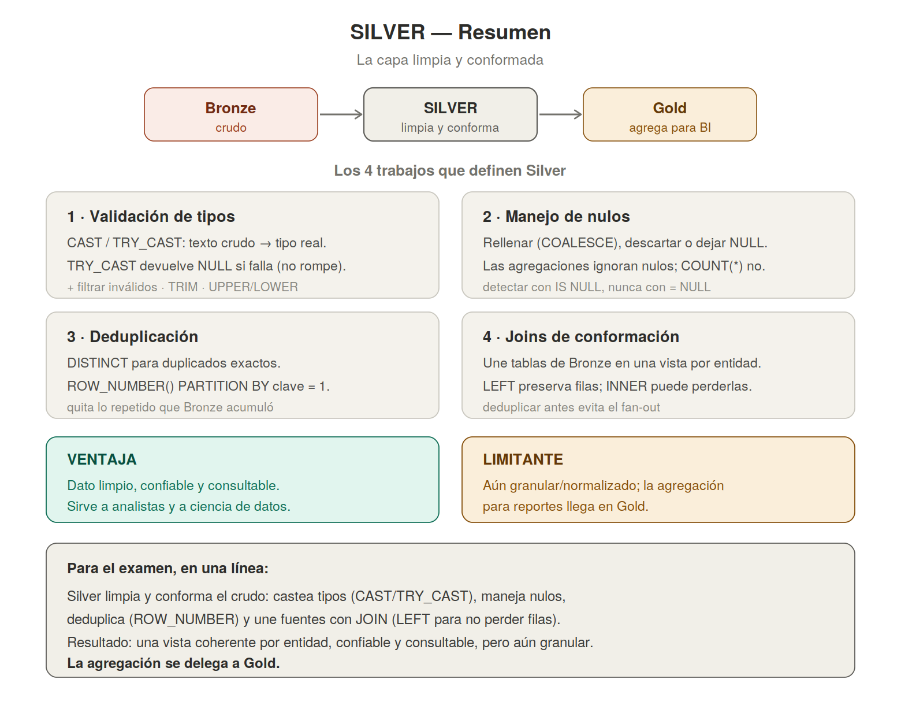


# Gold : En detalle

Gold tiene esencialmente tres trabajos, y los veremos uno por uno con el mismo detenimiento:

> Gold lo deja el dato **resumido y listo para el negocio**. Es la capa donde el analista pasa la mayor parte del tiempo, porque es la que alimenta dashboards, Genie y reportes.

El cambio clave entre Silver y Gold es de **granularidad**. Silver tiene una fila por evento individual (cada venta, cada clic). Gold tiene una fila por **unidad de decisión de negocio** (ventas por región y mes, ingreso por producto). Pasas del "qué pasó exactamente" al "qué necesito saber para decidir".

Gold tiene esencialmente tres trabajos:


1. La **agregación** es el primero y el que la define: resumir el detalle de Silver en métricas (`SUM`, `COUNT`, `AVG`) agrupadas por las dimensiones del negocio (`GROUP BY` región, mes, producto). Es lo que convierte millones de filas en una tabla que un gerente puede leer.


2. El **modelado dimensional** es el segundo: organizar esas tablas en un **esquema estrella** —una tabla de hechos rodeada de dimensiones— que es la estructura que el BI espera y la que el examen asocia directamente con Gold (Sección 8).

3. La **materialización para consumo** es el tercero: dejar el resultado precalculado y refrescado (**vistas materializadas**, tablas Gold) para que el dashboard responda rápido, sin recalcular cada vez.

El resultado de los tres es lo que define a Gold: tablas **rápidas, agregadas y listas para BI**. Y su limitante, que ya conoces, es la cara B de eso: al estar agregada **pierde granularidad** (no sirve para `drill-down` arbitrario), está hecha a la medida de ciertas preguntas, y tiene **latencia de refresco** (no es tiempo real, salvo que uses Streaming Tables).

## Agregación

1. Empecemos por el primero, la **agregación**, que es la razón de ser de Gold.

La idea raíz: agregar es **colapsar muchas filas en una sola** aplicando una función de resumen. En Silver tienes una fila por venta; en Gold quieres una fila por región con el total vendido. Eso se hace con dos piezas que siempre van juntas: una **función de agregación** (qué calcular) y un `GROUP BY` (por qué dimensión agrupar).

```sql
SELECT
  region,
  COUNT(*)        AS num_ventas,
  SUM(monto)      AS total_vendido,
  AVG(monto)      AS ticket_promedio
FROM silver.ventas
GROUP BY region;
```

Desmenuzado: `GROUP BY region` arma un grupo por cada región; las funciones (`COUNT`, `SUM`, `AVG`) calculan **una métrica por grupo**; el resultado es una fila por región. Pasaste del detalle al resumen.

Las funciones de agregación a tener fichadas para el examen: `COUNT` (cuántos), `SUM` (total), `AVG`/`MEAN` (promedio), `MIN`/`MAX` (extremos), `COUNT(DISTINCT col)` (cuántos valores únicos) y `APPROX_COUNT_DISTINCT` (lo mismo pero **aproximado y más rápido**, para volúmenes enormes). Recuerda lo de Silver: estas funciones **ignoran los nulos**, salvo `COUNT(*)` que cuenta todas las filas.

Dos reglas de sintaxis que el examen pregunta directo:

**Toda columna que selecciones sin agregar debe estar en el `GROUP BY`.** Si pones `SELECT region, mes, SUM(monto)` tienes que agrupar por `region, mes`. Olvidarlo es el error clásico de "fix a query".

**`WHERE` filtra antes de agregar; `HAVING` filtra después.** `WHERE monto > 0` descarta filas crudas antes de sumar; `HAVING SUM(monto) > 1000` descarta **grupos** cuyo total no llega a mil. No puedes usar un agregado en `WHERE`; para eso existe `HAVING`.

Un nivel más: los **subtotales jerárquicos**. Cuando un reporte necesita totales por región *y además* el gran total, no haces dos consultas: usas `ROLLUP` (subtotales jerárquicos, ej. por región y luego total general), `CUBE` (**todas** las combinaciones posibles de las dimensiones) o `GROUPING SETS` (tú defines qué combinaciones). La distinción `ROLLUP` vs `CUBE` aparece en el examen: jerárquico vs todas las combinaciones.

Para el examen, en una línea: **agregar en Gold colapsa el detalle de Silver en métricas con funciones (`SUM`, `COUNT`, `AVG`) y `GROUP BY` por dimensión; toda columna no agregada va en el `GROUP BY`, `WHERE` filtra antes y `HAVING` después, y para subtotales se usa `ROLLUP` (jerárquico) o `CUBE` (todas las combinaciones).**


## Modelo Dimensional

2. Agregar (lo anterior) produce tablas resumidas, pero si dejas todo en una sola tabla gigante con cientos de columnas mezcladas, el análisis se vuelve lento y confuso. El modelado dimensional organiza esas tablas separando dos cosas que son distintas por naturaleza: lo que mides y aquello por lo que mides. De ahí salen los dos tipos de tabla del esquema estrella.

La **tabla de hechos** (`fact`) guarda los **eventos medibles del negocio** y sus métricas numéricas: una fila por venta, con `monto`, `cantidad`, `descuento`. Es la tabla central, suele ser la más grande, y contiene sobre todo números que se van a sumar o promediar, más las **claves** que apuntan a las dimensiones.

Las **tablas de dimensión** (`dimension`) guardan el **contexto descriptivo**: quién, qué, cuándo, dónde. La dimensión `cliente` (nombre, país, segmento), la dimensión `producto` (categoría, marca), la dimensión `tiempo` (día, mes, año). Son tablas más pequeñas, con texto descriptivo, y son por las que vas a **filtrar y agrupar**.

Se llama **estrella** porque al dibujarlo queda la tabla de hechos en el centro y las dimensiones alrededor, conectadas por claves, como los picos de una estrella. En una consulta real, haces `JOIN` de la tabla de hechos con las dimensiones que necesites, y agregas: "suma de `monto` (hecho) por `categoría` (dimensión producto) y por `mes` (dimensión tiempo)". Hechos para los números, dimensiones para el contexto.

Ahora la distinción que el examen pregunta: **estrella vs. copo de nieve vs. data vault.**

### Esquema Estrella

El **esquema estrella** (`star`) tiene las dimensiones **desnormalizadas**: toda la descripción de un producto vive en una sola tabla `producto`, aunque eso repita datos (la categoría "Bebidas" aparece en mil filas).

Cada dimensión es una tabla ancha y desnormalizada (un `dim_`por cada concepto)

Ventaja: **menos joins, consultas más rápidas y simples**. Es el preferido para BI y el que vive en **Gold**.

**Fact table (tabla de hechos) →** el centro; contiene las métricas/medidas numéricas (ventas, cantidad) + las claves foráneas (FK) hacia cada dimensión.

**Dimension tables →** rodean al fact; son anchas y desnormalizadas (un dim_ por concepto), con los atributos descriptivos.

**Quién une a todos:** la fact table. Ella sostiene las FKs que apuntan a la PK de cada dimensión.

### Copo de Nieve

El **copo de nieve** (`snowflake`) toma esas dimensiones y las **normaliza**: separa `producto` → `categoría` → `departamento` en sub-tablas enlazadas. 

Dimensiones normalizadas en sub-tablas relacionadas por FK (reduce redundancia, más joins).

Ventaja: menos redundancia y menos espacio. Desventaja: **más joins**, consultas más complejas y lentas. Se usa cuando ahorrar espacio o mantener integridad pesa más que la velocidad.

Mismo fact + dimensiones, pero cada dimensión está normalizada en sub-dimensiones (ej. `dim_customer → dim_customer_address, dim_customer_segment`).

**Quién une a todos:** igual el fact hacia las dimensiones, y además cada dimensión se conecta a sus sub-dimensiones por FK. **Resultado:** menos redundancia, más joins.

### Data Vault

El **data vault** es otro paradigma: organiza en `hubs` (claves de negocio), `links` (relaciones) y `satellites` (atributos e historial). 

Hubs, links y satellites (historial auditable, orientado a origen),

Su fuerte es ser **muy auditable y escalable para la ingesta** de muchas fuentes; por eso se asocia más a **Silver** que a Gold. No es un modelo de consumo para BI, es de integración.

Tres componentes, cada uno con un rol estricto:

**Hub →** guarda la lista única de claves de negocio (business keys): customer_id, product_id, etc. Es el concepto/entidad en sí. Solo lleva la clave + un hash + metadatos de carga. No tiene atributos descriptivos ni relaciones.

**Link →** es el que une a todos. Conecta dos o más hubs entre sí; representa la relación, asociación o transacción entre claves de negocio (ej. "este cliente compró este producto"). Guarda los hash keys de los hubs que enlaza. Si la pregunta dice "qué componente relaciona/une las entidades" → Link.

**Satellite →** cuelga de un hub o de un link y guarda los atributos descriptivos e historial (contexto + cambios en el tiempo, con fechas de carga). Aquí vive el historial tipo SCD.

Gancho de memoria: Hub = quién/qué (el sustantivo) · Link = quién se relaciona con quién (el conector) · Satellite = los detalles y el cuándo.

> Estrella = desnormalizado, rápido, para BI/Gold; Copo de Nieve = normalizado, menos redundancia, más joins; Data Vault = auditable y escalable, para integración/Silver.

Y aquí se cierra el sentido de la Medallion completa, que es exactamente lo que evalúan: 

>**Bronze** es crudo (sin modelar), **Silver** es limpio/normalizado (donde puede vivir un data vault), y **Gold** es el **modelo dimensional / estrella** listo para BI. 

>Si una pregunta describe "tablas desnormalizadas, optimizadas para dashboards", la respuesta es estrella en Gold.

>El modelado dimensional en Gold organiza el dato en un esquema estrella, una tabla de hechos (métricas) rodeada de dimensiones desnormalizadas (contexto), porque minimiza joins y acelera el BI; el copo de nieve normaliza las dimensiones (más joins) y el data vault es para integración auditable (Silver).

## Galaxy / fact constellation

Es básicamente dos o más esquemas estrella unidos. Lo que lo define: tienes varias tablas de hechos (`fact_`) y comparten algunas dimensiones en lugar de duplicarlas. Esas dimensiones compartidas se llaman dimensiones conformadas (`conformed dimensions`) — son la pieza que "une a todos" los facts.

**Quién une a todos:** las dimensiones conformadas. Cada fact apunta hacia ellas con FKs; al ser la misma dim_producto o dim_fecha para ambos facts, garantizan que "producto" o "fecha" signifiquen exactamente lo mismo en todos los reportes.
Para qué sirve: analizar procesos de negocio distintos (ej. ventas y devoluciones) de forma consistente y poder cruzarlos.
Cómo lo reconoces en el examen: la descripción menciona más de una tabla de hechos + dimensiones que ambas reutilizan. Si solo hay un fact → es Star (o Snowflake si las dims están normalizadas).

Varias tablas de hechos (ej. `fact_ventas`, `fact_devoluciones`).

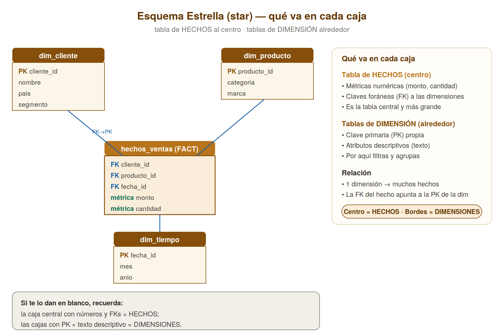
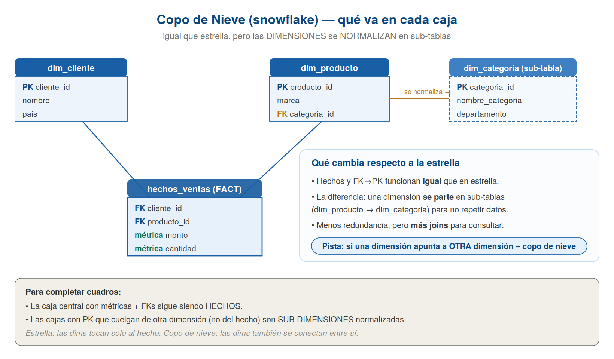
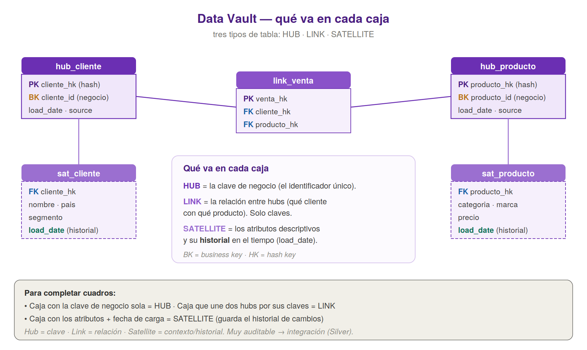
Galaxy / fact constellation
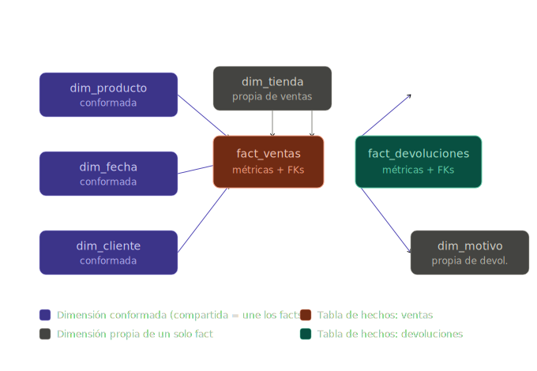

> Galaxy = 2+ facts unidos por dimensiones conformadas. Si solo hay 1 fact, NO es Galaxy (es Star o Snowflake).

## Materialización para consumo

Es el paso que conecta directamente con tu trabajo de analista, porque define **por qué un dashboard responde en un segundo o en treinta**.

Queda una decisión: ¿esa tabla Gold **guarda el resultado calculado**, o lo **recalcula cada vez** que alguien abre el dashboard? "Materializar" significa, justamente, **dejar el resultado físicamente guardado** en lugar de recalcularlo al vuelo. Y esa decisión es la que el examen pregunta como "vista vs. vista materializada".

- Una **vista normal** (`VIEW`) es solo una consulta guardada con nombre. No almacena datos: **cada vez** que la consultas, se ejecuta el SQL completo por debajo. Si tu dashboard se apoya en una vista que agrega millones de filas de Silver, cada refresco recalcula todo. 

Ventaja: el dato siempre está fresco y no ocupa espacio. 

Desventaja: **lento y caro** si la consulta es pesada.

- Una **vista materializada** (`MATERIALIZED VIEW`) **sí guarda el resultado precalculado** como una tabla física, y lo **refresca** periódicamente. Cuando el dashboard la consulta, lee un resultado ya listo, no recalcula nada. Por eso es **rápida**. Es la herramienta canónica de Gold para BI: consultas complejas y frecuentes sobre datos que no cambian a cada segundo.

> El criterio de decisión, en una frase: **si la consulta es pesada y se repite mucho (un dashboard), materializa; si necesitas frescura absoluta y el cálculo es ligero, una vista normal basta.**

Aquí va el matiz técnico que el examen valora, y que ya tocamos: el **refresco incremental**. La vista materializada, al refrescarse, idealmente recalcula **solo lo que cambió** (gracias al motor de Databricks), no toda la tabla. Pero eso solo funciona si la consulta es "bien portada": si usas funciones **no deterministas** (`CURRENT_DATE()`, `RANDOM()`, `UUID()`) o ciertos joins complejos, el motor no puede hacer el refresco incremental y cae en un **recálculo completo**, que es caro. Regla para recordar: **MV para BI = evitar funciones no deterministas si quieres refresco barato.**

Conviene también ubicar la **tabla Gold "normal"** (una tabla física construida con `CREATE TABLE ... AS SELECT`, o por un pipeline). También guarda el resultado, pero su actualización la controlas tú (reejecutando el pipeline o un `MERGE`). La diferencia con la MV es **quién gestiona el refresco**: en la MV, Databricks lo automatiza y optimiza; en una tabla, lo orquestas tú. Para análisis BI, la MV suele ser la opción más cómoda.

Y no olvides la frontera con tiempo real, que ya marcamos: si el dashboard necesita datos **al instante** (sensores, eventos en vivo), ni la vista ni la MV son la respuesta —ahí va una **Streaming Table**. La MV refresca por lotes, no es streaming. Esa distinción "MV (BI sobre datos estáticos) vs. Streaming Table (tiempo real)" es una pregunta clásica.

> Materializar en Gold es guardar el resultado agregado precalculado en una vista materializada que se refresca por lotes, para que el dashboard lea rápido sin recalcular; se prefiere a la vista normal cuando la consulta es pesada y frecuente, y conviene evitar funciones no deterministas para que el refresco sea incremental (barato).
>
> MV stores (almacena resultados precomputados)
> DV recomputes (calcula cada vez que se consulta)

CUÁNDO USAR CADA UNA:
- MV: Reportes que NO cambian frecuentemente, acceso frecuente
- DV: Datos que cambian constantemente, acceso ocasional

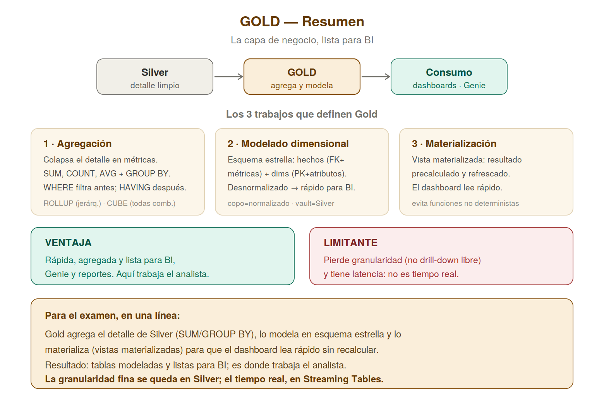

# Databricks SQL / SQL Warehouses


Esta sección tiene, a grandes rasgos, **siete ladrillos**:

1. El **SQL Warehouse**: El cómputo que ejecuta todo, es el primero y el que da nombre a la sección.

2. El **Databricks Assistant**: La IA que te ayuda a escribir y depurar SQL (`/explain`, `/fix`, `/optimize`, `/generate`).

3. Las **consultas federadas**: Consultar y unir fuentes externas (PostgreSQL, MySQL) sin mover los datos.

4. Las **vistas y tablas especiales**: Vista, vista materializada, streaming table y dynamic view (la pregunta-trampa que ya viste).

5. Las **operaciones de consulta**: Agregaciones, joins, operaciones de conjunto, filtros, orden y subconsultas (el SQL "de pan").

6. Las **tablas managed vs. external**: Dónde viven los datos y qué pasa al hacer `DROP`.

7. El **time travel de Delta Lake**: Consultar versiones pasadas de una tabla.


## SQL Warehouse

- El SQL Warehouse es el **motor de cómputo** sobre el que corre todo lo que haces como analista. Cuando ejecutas una consulta en el SQL Editor, cuando un dashboard se refresca, cuando alguien le pregunta a Genie, **por debajo siempre hay un SQL Warehouse encendido haciendo el trabajo**. Sin warehouse, no hay cómputo, y nada se ejecuta. Esa dependencia es justo lo que el examen comprueba con preguntas como "el dashboard no refresca, ¿qué reviso?".

Hay **tres tipos** de SQL Warehouse, y conviene tenerlos ordenados por dónde corre el cómputo y qué tan rápido arranca:

### Serveles

El **Serverless** es el recomendado y el más usado: arranca en **segundos**, lo gestiona Databricks por completo (el cómputo vive en la cuenta de Databricks), y no tienes que administrar nada. Es la opción por defecto para Databricks SQL.

### Pro

El **Pro** corre en tu propia cuenta de la nube y soporta funciones avanzadas, pero arranca más lento que el serverless.

### Classic

El **Classic** es la versión básica, también en tu nube, con menos prestaciones. Para el examen basta recordar el orden: **serverless = más rápido de arrancar y sin gestión; classic = el más básico.**

Dos conceptos de configuración que el examen toca y que conviene **no confundir** porque resuelven problemas distintos:

### Detalle de Tamaño

El **tamaño** del warehouse (las "tallas" tipo S, M, L, XL) atiende la **complejidad/volumen de una consulta**: una consulta pesada sobre muchos datos necesita una talla más grande. Es potencia "vertical".

### Detalle de Escalado

El **escalado** (definir un mínimo y máximo de clústeres) atiende la **concurrencia**: muchos usuarios consultando a la vez. Databricks añade clústeres extra cuando hay cola y los quita cuando baja la demanda. Es capacidad "horizontal". Regla: **consulta lenta y pesada → más tamaño; muchos usuarios simultáneos → más escalado.**

### Detalle del Auto-Stop

El **auto-stop** (auto-detención). Para ahorrar costo, el warehouse **se apaga solo tras un periodo de inactividad**. Esto es bueno para la factura, pero tiene una consecuencia directa: **si el warehouse está auto-detenido cuando un dashboard intenta refrescarse, el refresco falla** (o tarda en arrancar el warehouse). Por eso, ante "programé un refresco cada 10 minutos y no funciona", la respuesta es asegurarse de que el warehouse **esté encendido y no se auto-detenga** antes del refresco. Es la pregunta clásica de esta sección.

> El warehouse va **acelerado por Photon** (el motor vectorizado), y cada consulta que corre en él queda registrada en el **Query History** con su **Query Profile**, que es lo que usarás para diagnosticar consultas lentas.

> El SQL Warehouse es el cómputo (acelerado por Photon) que ejecuta toda consulta SQL, dashboard y Genie; el serverless es el más rápido y gestionado; el tamaño atiende la complejidad de la consulta y el escalado la concurrencia; y debe estar encendido (no auto-detenido) para que un dashboard pueda refrescarse.

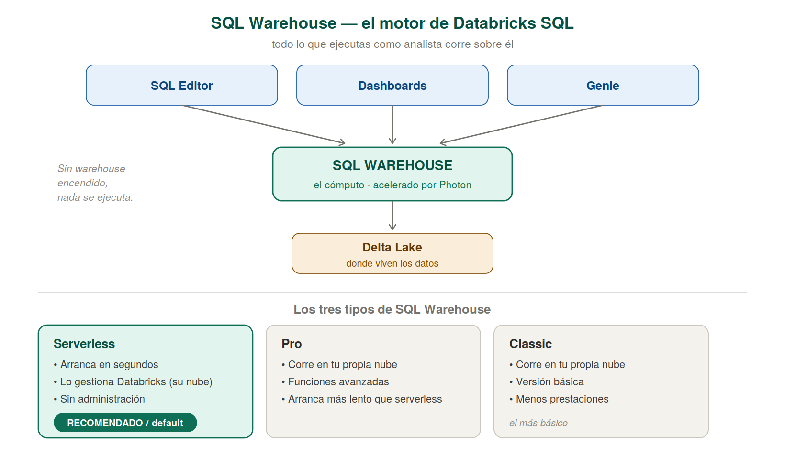
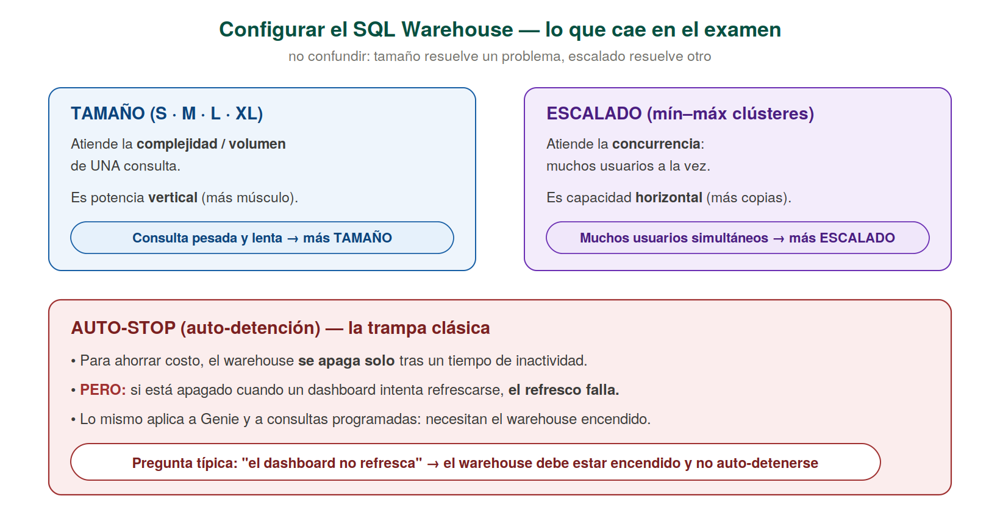

## Databricks Assistand

El Databricks Assistant es la **IA con contexto** integrada en el Notebook y en el SQL Editor. Sabe de tus tablas y consultas, y sirve para cuatro cosas: **explicar, optimizar, generar y arreglar** SQL. El examen casi nunca pregunta "qué es"; pregunta **"cuál comando uso en esta situación"**. Por eso lo importante es asociar cada comando a su disparador.

Los cuatro comandos y su gatillo de examen:

### /explain

`/explain` → Cuando piden una **explicación en lenguaje sencillo, paso a paso**, de qué hace una consulta o **por qué no devuelve lo esperado**. Palabras clave en el enunciado: "step-by-step explanation", "plain English description", "understand why the query…". Es para *entender/depurar conceptualmente*.

### /optimize

`/optimize` → Cuando piden **mejorar el rendimiento** de una consulta lenta: "suggest improvements", "filter push down", "join reordering", "long-running query". Es para *acelerar*, no para explicar.

### /generate

`/generate` → Cuando piden **crear una consulta nueva a partir de una descripción** en lenguaje natural ("write a query that…"). De texto a SQL.

### /fix

`/fix` → cuando hay un **error** y se quiere que el Assistant lo **interprete y proponga el SQL corregido en línea**. Lo que el Assistant *puede hacer* es "sugerir correcciones en el SQL Editor".

> **La trampa principal**: no confundir `/explain` con `/optimize`. Si el enunciado habla de **entender/explicar** → `/explain`; si habla de **rendimiento/mejorar/acelerar** → `/optimize`. Las dos suenan parecido pero resuelven cosas distintas; los enunciados las separan con esas palabras clave.


> Dos datos de contexto que también pueden caer: el Assistant funciona **tanto en Notebook como en SQL Editor** (no solo notebooks), y **no requiere extensión** (está integrado). Por debajo se apoya en el **Data Intelligence Engine**, que es lo que le da el contexto de tus datos.

> El Databricks Assistant (en Notebook y SQL Editor) usa `/explain` para describir/depurar una consulta en lenguaje sencillo, `/optimize` para proponer mejoras de rendimiento, `/generate` para crear SQL desde una descripción y `/fix` para corregir errores en línea; la clave es mapear el verbo del enunciado (entender vs. acelerar vs. crear vs. arreglar) al comando.

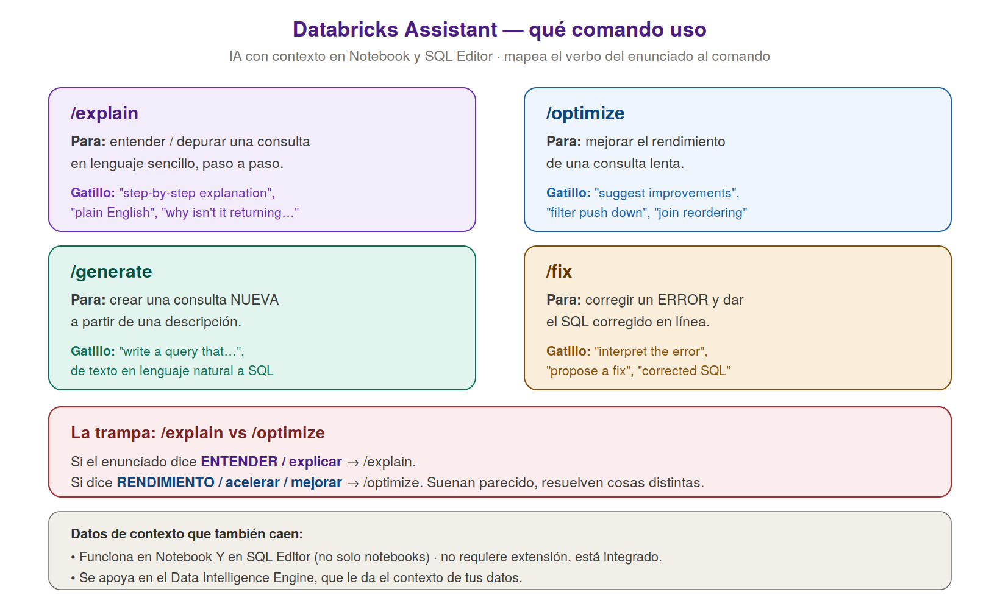

## Lakehouse Federation

- Normalmente, para analizar datos que viven en otra base (un PostgreSQL, un MySQL, un Redshift), tendrías que **copiarlos** primero a Databricks con un pipeline de ingesta. Eso tiene dos problemas: los datos quedan **desactualizados** (trabajas sobre una copia de ayer) y montas plomería extra que hay que mantener. La **Lakehouse Federation** resuelve esto permitiéndote **consultar la fuente externa directamente, en vivo, sin copiar nada**, y hasta **unirla (`JOIN`) con tus tablas Delta** en una sola consulta.

**Cómo funciona, en tres pasos que conviene tener claros porque el examen describe justo este flujo:**

1. Primero defines una **conexión** a la base externa (credenciales, host). Luego registras un **foreign catalog** (catálogo externo): Unity Catalog "monta" la base remota como si fuera un catálogo más dentro de tu namespace de tres niveles. 
2. A partir de ahí, esa base externa aparece en el Catalog Explorer como cualquier otro catálogo, y la consultas con SQL normal. 
3. El tercer paso es simplemente escribir **una sola consulta SQL** que une la tabla federada con tu tabla Delta.

```sql
SELECT d.cliente_id, d.total_local, f.score_credito
FROM gold.clientes        AS d            -- tabla Delta
JOIN pg_externo.public.scores AS f        -- tabla federada (foreign catalog)
  ON d.cliente_id = f.cliente_id;
```

Fíjate en lo importante: en el `JOIN` conviven una tabla Delta y una tabla que físicamente está en PostgreSQL, y tú no moviste nada. Databricks va a buscar el dato remoto en el momento de la consulta.

Las **ventajas** que el examen quiere que asocies a la federación, frente a la alternativa de copiar:

- **Datos en vivo:** consultas el estado actual de la fuente, no una copia vieja.

- **Sin replicación ni ETL:** no montas pipelines para mover los datos, lo que evita costo y mantenimiento.

- **Gobierno de Unity Catalog:** y este es el matiz clave del examen. Como la fuente externa entra como foreign catalog, **se le aplican los permisos y el linaje de Unity Catalog**, igual que a cualquier tabla. En cambio, si leyeras esa base con un driver JDBC desde un notebook, **te saltarías ese gobierno**. Por eso, cuando la pregunta dice "unir con la fuente externa **bajo gobierno de Unity Catalog y sin copiar**", la respuesta es **Lakehouse Federation**, no JDBC ni copiar a Delta.

Vale la pena fichar las **respuestas-trampa**, porque son las que descartas: 
- Leer la fuente con **JDBC en un notebook** (funciona, pero se salta el gobierno).
-  **Copiar la tabla a Delta con un job nocturno** (introduce datos desactualizados, *stale*), o pedirle al DBA que haga el join por fuera (no es un patrón de Databricks). Todas suenan plausibles; la correcta es siempre la federación.

> Un detalle de vocabulario para no perder puntos: el término que verás es **"cross-system analytics"** (análisis entre sistemas) o **"federated query / Lakehouse Federation"**, y la pieza concreta que registras es el **"foreign catalog"**. Si ves esas palabras, piensa federación.

> La Lakehouse Federation consulta y une fuentes externas (PostgreSQL, MySQL, Redshift) en vivo registrándolas como un foreign catalog en Unity Catalog, sin copiar los datos; así haces un `JOIN` entre una tabla Delta y la fuente remota en una sola consulta, conservando permisos y linaje, a diferencia de JDBC (se salta el gobierno) o copiar a Delta (datos desactualizados).

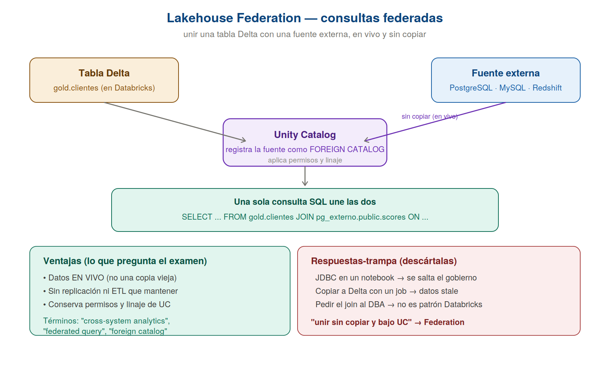

## Vistas y Tablas Especiales

Las **vistas y tablas especiales** son **cuatro objetos** que se parecen pero resuelven cosas distintas; el truco es saber **cuándo usar cada uno**.

> La **idea raíz**: todos sirven para "guardar una consulta con nombre", pero se diferencian en **dos ejes**: ¿guardan el resultado o lo recalculan?, y ¿procesan datos en lote o en tiempo real? Ubicarlos en esos dos ejes es lo que el examen comprueba.

### VIEW

La **vista normal** (`VIEW`) es solo una consulta guardada. **No almacena datos**: cada vez que la consultas, se ejecuta el SQL completo por debajo. 

Ventaja: dato siempre fresco, cero almacenamiento. 

Desventaja: lenta y cara si la consulta es pesada y se repite mucho. Úsala para lógica reutilizable y ligera.

### MATERIALIZED VIEW

La **vista materializada** (`MATERIALIZED VIEW`) **sí guarda el resultado precalculado** como tabla física y lo **refresca por lotes**. Cuando la consultas, lee un resultado ya listo, no recalcula. Por eso es **rápida**. Es la herramienta para **consultas complejas y frecuentes sobre datos relativamente estáticos** (dashboards BI). "Una agregación diaria que se refresca tras la carga del día" → vista materializada.

Recuerda el matiz: para que el refresco sea **incremental** (barato), evita funciones **no deterministas** (`CURRENT_DATE()`, `RANDOM()`, `UUID()`).

### Streaming Table

La **streaming table** procesa datos que **llegan continuamente**, fila por fila, una sola vez (append). Es para **tiempo real / ingesta continua** (sensores, eventos en vivo). No es para BI sobre datos estáticos.

### Dynamic View

La **dynamic view** es una vista con **lógica de seguridad** incrustada: enmascara o filtra columnas/filas **según quién consulta** (con `CASE` sobre el usuario o grupo). Su propósito no es rendimiento ni frescura, sino **proteger PII**. Conecta con la Sección de Securing Data.

> Ahora **la trampa estrella**, que es comparar streaming table vs. vista materializada. El enunciado típico te da dos casos a la vez:

**Caso A:** *análisis en tiempo real de datos de sensores que llegan continuamente.*
**Caso B:** *consultas frecuentes y complejas sobre datos estáticos para dashboards de BI.*

La respuesta correcta cruza cada caso con su objeto: **Streaming Table para los sensores (tiempo real)** y **Materialized View para el BI (estático)**. Las opciones incorrectas siempre intentan que uses el mismo objeto para los dos, o que los inviertas. La regla mental: 

- "continuo / tiempo real" → Streaming Table.
"frecuente / complejo / estático / BI" → Materialized View.

> La otra distinción que cae es **dynamic view vs. materialized view**, que suenan parecido pero no tienen nada que ver: la **dynamic** es para **seguridad** (esconder PII por usuario); la **materialized** es para **rendimiento** (precalcular). Si la pregunta habla de ocultar columnas sensibles según el rol del usuario → dynamic view, no materialized.

> VIEW recalcula siempre (fresco pero lento); MATERIALIZED VIEW guarda el resultado precalculado y refresca por lotes (rápido, para BI sobre datos estáticos); STREAMING TABLE procesa datos continuos en tiempo real; DYNAMIC VIEW enmascara filas/columnas por usuario (seguridad/PII). Trampa: tiempo real → Streaming Table; BI estático → Materialized View; ocultar PII → Dynamic View.

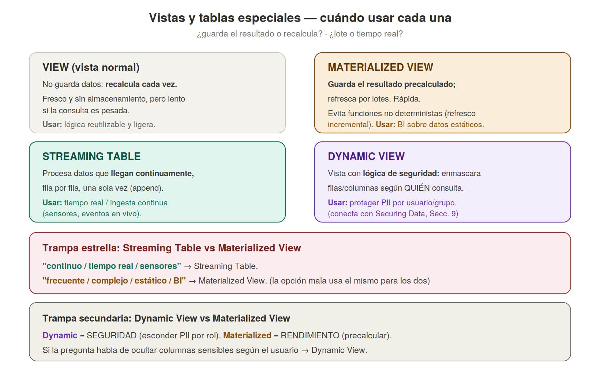

## Operaciones de Consulta

Las **operaciones de consulta**, el SQL "de pan" que el examen da por sentado. Son cinco grupos.

### Joins

**1. Joins (unir tablas por filas que coinciden).** Lo que el examen comprueba es que sepas **qué conservas con cada tipo**: `INNER` solo las coincidencias; `LEFT` todo lo de la izquierda (lo no coincidente queda en `NULL`); `RIGHT` todo lo de la derecha; `FULL OUTER` todo de ambos; `CROSS` el producto cartesiano. Hay dos especiales: `LEFT SEMI` (filas de la izquierda **que tienen** match, sin traer columnas de la derecha) y `LEFT ANTI` (filas de la izquierda **sin** match). Los joins pueden ser por una o varias claves (`ON a.id=b.id AND a.linea=b.linea`). 

> Regla de examen: `INNER` puede hacerte perder filas; `LEFT` las preserva.

### Operaciones de Conjunto

**2. Operaciones de conjunto (apilar resultados por filas).** `UNION` combina dos resultados y **quita duplicados**; `UNION ALL` los combina y **mantiene duplicados** (es más rápido porque no deduplica). `INTERSECT` deja solo lo común; `EXCEPT` lo que está en el primero y no en el segundo. La distinción que cae: **`UNION` deduplica, `UNION ALL` no.**

### Agregación

**3. Agregación.** Funciones: `COUNT`, `COUNT(DISTINCT col)`, `APPROX_COUNT_DISTINCT(col)` Usa **HyperLogLog++** para dar un conteo **aproximado y rápido** en volúmenes enormes, `AVG`/`MEAN`, `SUM`, `MIN`/`MAX`. Recuerda que **ignoran nulos**, salvo `COUNT(*)`. Las reglas que más caen: **`WHERE` filtra antes de agregar; `HAVING` filtra después** (sobre el agregado). Pueden pedirte justo "reemplazar `WHERE` por `HAVING`" para filtrar por un `AVG`; y toda columna no agregada **debe ir en el `GROUP BY`**. Para subtotales: `ROLLUP` (jerárquico) y `CUBE` (**todas** las combinaciones de dimensiones).

### Filtrar, ordenar y subconsultas

**4. Filtrar, ordenar y subconsultas.** `WHERE` filtra filas, `ORDER BY` ordena, `LIMIT` recorta, `DISTINCT` quita duplicados. Una **subquery** es un `SELECT` dentro de otro `SELECT`; un **CTE** es `WITH nombre AS (...)` para legibilidad. Los **query snippets** son bloques de SQL reutilizables (no confundir con CTE: el snippet es un atajo de la herramienta, el CTE es parte de la consulta).

### Crear tablas uniendo fuentes

**5. Crear tablas uniendo fuentes.** Crear tablas **combinando datos de varias fuentes** (`CSV`, `Parquet`, `Delta`) en un dataset unificado, con `CREATE TABLE ... AS SELECT ... JOIN ...`. Es el `JOIN` aplicado a la construcción de tablas, no solo a consultar.

> Domina qué conserva cada join (`INNER` pierde filas, `LEFT` no), `UNION` (deduplica) vs `UNION ALL` (no), las agregaciones con `WHERE` antes / `HAVING` después y toda columna no agregada en `GROUP BY`, `APPROX_COUNT_DISTINCT` (rápido y aproximado, HyperLogLog++), subquery vs CTE, y que puedes crear tablas unificadas uniendo CSV/Parquet/Delta.

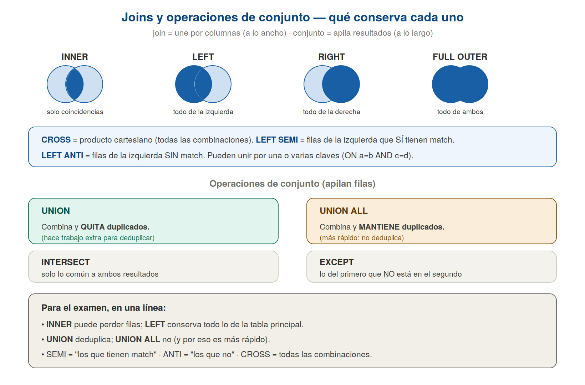
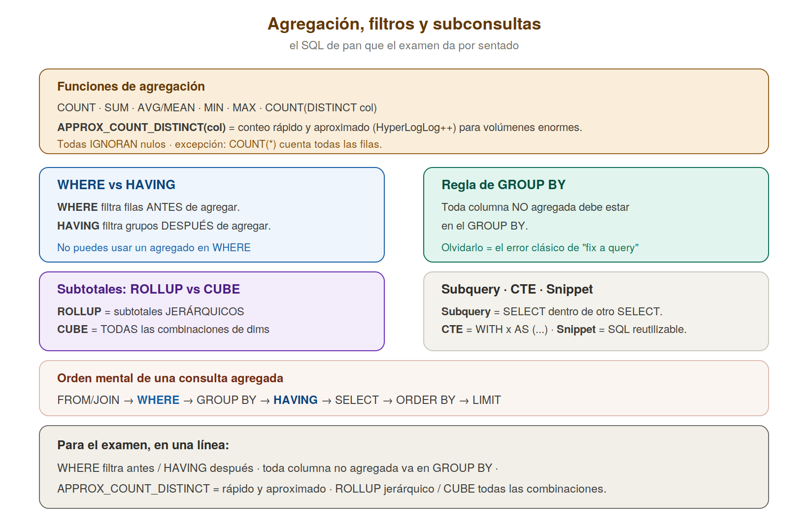


## Managed vs. external tables

La **idea raíz**: la diferencia no es cómo consultas la tabla (eso es igual), sino **quién es dueño de los archivos de datos** y, sobre todo, **qué pasa cuando borras la tabla**.

### Managed vs External vs Volume + qué pasa al hacer DROP

Las tres son objetos de Unity Catalog, pero gobiernan cosas distintas. Una managed table se crea con `CREATE TABLE ... AS SELECT` y Databricks controla metadatos y archivos. Una external table necesita `LOCATION '...'` y los datos viven fuera del almacenamiento gestionado. Un volume es para archivos no tabulares (PDF, imágenes), referenciado como `catalog.schema.volume` o `/Volumes/...`.

La parte que más cae es el DROP:

- `DROP TABLE` sobre managed → se borran metadatos y archivos físicos.
- `DROP TABLE` sobre external → se borran solo los metadatos; los archivos quedan intactos en el storage.

> Cómo lo reconoces: 
> Si la pregunta menciona LOCATION o "datos en un bucket existente que no debe perderse" → external. 
> Si dice "Databricks gobierna todo de punta a punta" → managed.

### Tabla Managed

En una **tabla managed (gestionada)**, Unity Catalog controla **los datos y los metadatos**. Los archivos viven en la ubicación de almacenamiento que gestiona UC. 

Consecuencia clave: si haces `DROP TABLE`, **se borran también los datos físicos**. Es la opción por defecto y la más simple cuando los datos "nacen y mueren" dentro de Databricks.

### Tabla External

En una **tabla external (externa)**, los datos viven en una **ubicación externa que tú indicas** (`LOCATION 's3://...'`), y UC gestiona **solo los metadatos** (el registro de la tabla). 

Consecuencia clave: si haces `DROP TABLE`, **solo se quita el registro; los archivos de datos se conservan** en su sitio. Se usa cuando los datos los comparten otras herramientas o deben sobrevivir a la tabla.


> Si la pregunta dice **"qué pasa con los datos al hacer `DROP`"** o **"los datos deben persistir aunque se borre la tabla"** → **external**. Si dice "borrar la tabla elimina todo" → **managed**.

## Time travel

La **idea raíz**: como Delta Lake guarda **versiones** de cada tabla (recuerda Bronze, append-only), puedes consultar la tabla **como estaba en el pasado**. Hay **dos formas**, y el examen pregunta cuál sintaxis usar:

### VERSION AS OF <número>

`VERSION AS OF <número>` → viajas por **número de versión** (un entero, ej. la versión 12): `SELECT * FROM sales.orders VERSION AS OF 12;`.

### TIMESTAMP AS OF '<fecha-hora>

`TIMESTAMP AS OF '<fecha-hora>'` → viajas por **punto en el tiempo** (ej. cómo estaba a las 09:00 del 15-04-2026): `... TIMESTAMP AS OF '2026-04-15 09:00:00';`.

Para ver qué versiones existen: `DESCRIBE HISTORY tabla;` (muestra cada versión, la operación y la hora).

> Y **la trampa**: consultar una versión vieja —"hace 30 días"— puede **dar error**. ¿Por qué? Porque el time travel solo funciona **si los archivos de esa versión todavía están retenidos**; si `VACUUM` ya limpió los archivos antiguos (la retención por defecto ronda los 7 días), esa versión ya no es accesible. 

> Regla: **el time travel depende de la retención; expirada, falla.** 

> Ojo también con las sintaxis falsas que ponen de distractor: `AT TIME` y `BEFORE` **no existen** en Delta.

> Managed = UC controla los datos y `DROP` los borra; external = datos en tu ubicación y `DROP` solo quita el registro (los datos quedan). 
> Time travel: `VERSION AS OF n` (por versión) o `TIMESTAMP AS OF '...'` (por fecha); `DESCRIBE HISTORY` lista versiones, y falla si la retención expiró (`VACUUM`).

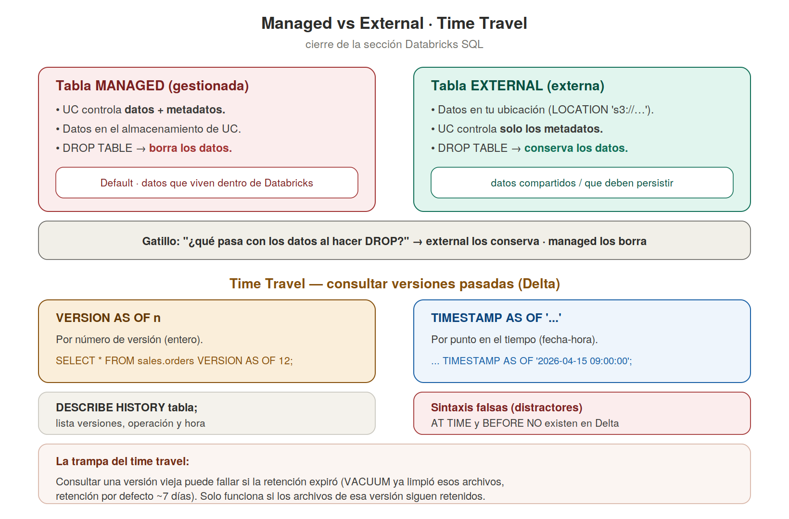

# Dashboards y Visualizaciones 

La dividimos en **siete ladrillos**:

1. Los **AI/BI Dashboards**: cómo se arma uno: datasets + widgets (visualización, texto, imagen), pestañas y varias fuentes.

2. Las **visualizaciones**: crearlas en notebooks y en el SQL Editor, y que una sola consulta puede alimentar varias.

3. Los **parámetros**: filtros dinámicos que se prueban antes de publicar.

4. Los **permisos y compartir**: usuarios/grupos del workspace, enlaces compartibles, embeber en apps externas.

5. El **refresco programado**: agendar la actualización (y que necesita el warehouse encendido).

6. Las **alertas**: umbral + destino, y de qué piezas se componen.

7. La **visualización correcta**: qué gráfico comunica cada cosa.
   
## Procesos UI clave / Resumen

- **Agregar widget:** Add Visualization -> Elige el tipo -> enlázalo a una query/dataset (un dashboard soporta múltiples dayasets).
- **Parámetros:** Usa marcadores `:region`, `:year` en la query -> el SQL Editor muestra cajas para probar valores antes de añadir al dashboard.
- **Schedule + email:** rea un schedule con la cadencia deseada y añade a los stakeholders como email subscribers en ese mismo schedule.
- **Alerta:** Query guardada + 1 columna a monitoriar + condición (ej. >) + umbral + destino (email/Slack/webhook).

### Permisos de dashboard 

- Aprender la escala
`CAN VIEW` (solo lectura) < `CAN RUN`< `CAN EDIT` < `CAN MANAGE`

- Por ejemplo: Para `ver pero no editar` -> `CAN VIEW`

### Elegir la visualización correcta

- **Funnel chart:** Caída entre etapas ordenadas (embudo de conversión).
- **Línea multi-serie (fecha en eje X):** Tendencia en el tiempo, varias series.
- **Text widge (markdown):** Texto/Títulos

### Ejemplo de estructura de código

```sql
-- Privilegios mínimos para LEER una tabla:
GRANT USE CATALOG ON CATALOG marketing TO analytics_users;
GRANT USE SCHEMA  ON SCHEMA  marketing.campaigns TO analytics_users;
GRANT SELECT      ON TABLE   marketing.campaigns.events TO analytics_users;

-- Row filter (seguridad por fila, sin duplicar la tabla):
--   función que usa is_account_group_member() para filtrar por región/grupo.

-- Column mask (enmascarar columna):
ALTER TABLE customers ALTER COLUMN phone_number SET MASK mask_fn;
```

## AI/BI Dashboards

La **idea raíz**: un dashboard en Databricks no es un solo gráfico, es un **lienzo** que combina piezas. Esas piezas se llaman **widgets**, y hay de tres tipos que el examen pide distinguir: 

1. **visualizaciones** (gráficos y tablas).
2.  **texto** (títulos, párrafos explicativos en Markdown) 
3. **imágenes** 

> Ejemplo: "necesito un párrafo descriptivo arriba del dashboard" → **widget de texto** (no un filtro, ni un counter).

Debajo de los widgets están los **datasets**: las consultas SQL que traen los datos. 

Un dashboard puede apoyarse en **varios datasets / varias fuentes** a la vez, y organizarse en **múltiples pestañas o páginas** para separar temas (ventas en una pestaña, inventario en otra). 

La estructura mental es: **dataset (los datos) → visualización (cómo se ven) → widget (la pieza en el lienzo) → página/pestaña (cómo se organiza)**.

Un punto que conecta con el SQL Warehouse: el dashboard **corre sus consultas sobre un SQL Warehouse**. 

Sin warehouse encendido, no hay datos. Y el término exacto que verás en el examen es **"AI/BI Dashboards"** (la generación nueva); si una pregunta menciona "legacy/SQL dashboards" se refiere a la versión antigua, pero el foco actual son los AI/BI.

> Un AI/BI Dashboard es un lienzo de widgets —visualizaciones, texto e imágenes— montados sobre datasets (consultas SQL) que corren en un SQL Warehouse; admite varias fuentes y múltiples pestañas; para un párrafo descriptivo se usa el widget de texto.

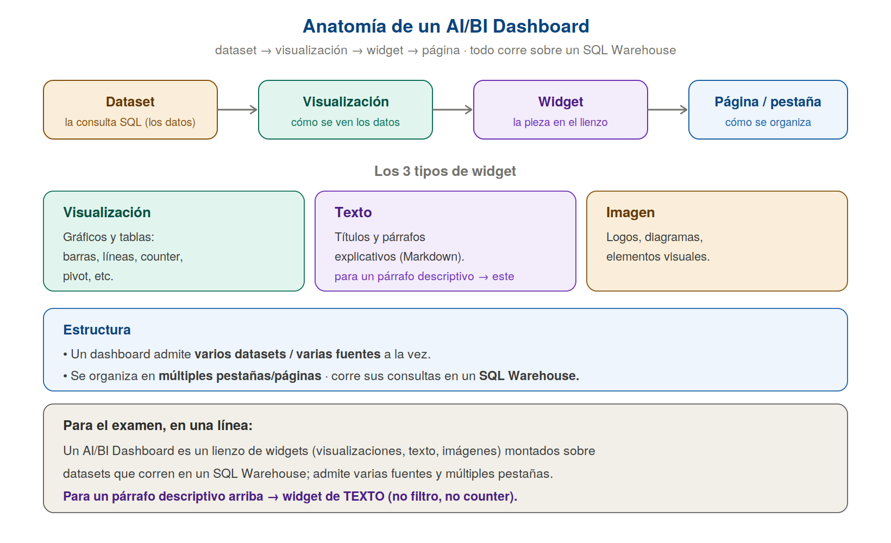

## Visualizaciones

- Aquí el examen comprueba dos cosas sencillas pero concretas: **dónde y cómo se crean**, y la relación **consulta ↔ visualización**.

La **idea raíz**: en Databricks una visualización **nace de un resultado de consulta**. Tú corres una query, obtienes una tabla de resultados, y sobre ese resultado **agregas una visualización** eligiendo el tipo (barras, líneas, counter…). 

La visualización no es un objeto independiente: está **atada a la consulta que la alimenta**.

**Dónde se crean** —y el examen pregunta los dos lugares:

### SQL Editor

1. En el **SQL Editor**: corres la consulta y, en el panel de resultados, agregas una visualización (el patrón es "ejecutar → en la celda de resultado, añadir visualización → elegir el tipo de gráfico"). Es el flujo de correr la query y, desde el resultado, añadir una visualización tipo línea.

### Notebooks

1. En los **Notebooks**: igual de directo: corres la celda y, **desde el resultado, agregas la visualización**: "add visualization from result". No necesitas exportar a CSV ni moverlo a un dashboard para graficar; el notebook grafica el resultado en el sitio.

> Y **el truco que más cae** : **una sola consulta puede alimentar varias visualizaciones**. 
> Sobre el mismo resultado puedes crear, por ejemplo, un gráfico de barras *y* un counter *y* una tabla, sin reescribir el SQL ni correr la query tres veces. 
> La pregunta lo plantea como "¿qué permite que el mismo dataset aparezca en distintos tipos de gráfico?" → **múltiples visualizaciones de una sola consulta**. 
> La ventaja práctica: una query, varias formas de contar la historia, y todas se actualizan juntas cuando cambian los datos.

Un matiz de vocabulario para no confundir piezas: la **consulta/dataset** es la fuente de datos; la **visualización** es una representación de ese dataset; y el **widget** es el contenedor que pones en el dashboard. Una consulta → muchas visualizaciones → cada una puede ir como widget en el lienzo.

También conviene saber que **dar formato** a la visualización (colores, etiquetas, títulos claros) no cambia el rendimiento ni el dato: mejora la **legibilidad y la narrativa**: el beneficio de formatear es "enhanced readability and storytelling". Es un punto fácil que cae tal cual.

> Las visualizaciones se crean desde el resultado de una consulta, tanto en el SQL Editor como en los Notebooks (no hay que exportar); una sola consulta puede alimentar varias visualizaciones (barras, counter, tabla…) a la vez, y dar formato mejora la legibilidad/narrativa, no el rendimiento.


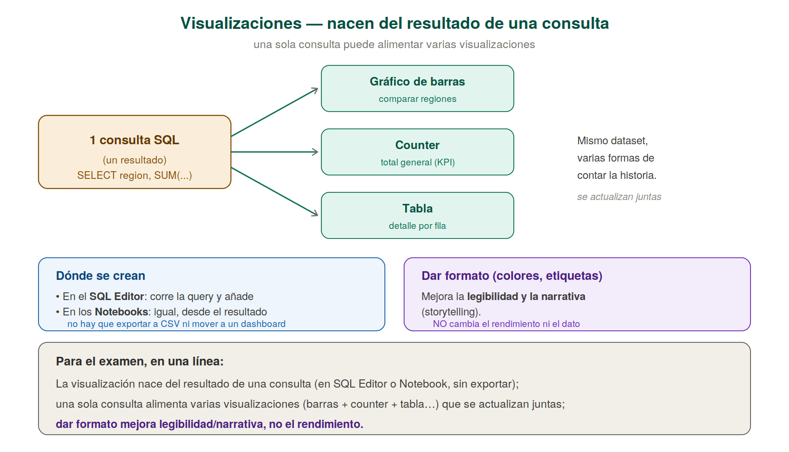

## Parámetros

Un parámetro es un **valor variable** que el usuario cambia para filtrar o modificar la consulta **sin reescribir el SQL**. En vez de tener una query "quemada" con `WHERE region = 'LATAM'`, pones un hueco <el parámetro> y el usuario elige el valor desde una cajita. La misma consulta sirve para cualquier región o año.

**Cómo se escriben**: con un marcador de parámetro con dos puntos, `:nombre`. Por ejemplo:

```sql
SELECT *
FROM gold.ventas
WHERE region = :region
  AND year   = :year;
```

Fíjate dónde van: **dentro del SQL, típicamente en la cláusula `WHERE`** (que es justo donde se filtra). Cuando escribes `:region`, el SQL Editor **te genera automáticamente una caja de entrada** para ese parámetro.

**El punto que pregunta el examen** Cómo **probar distintos valores antes de publicar** en un dashboard. 

La respuesta es directa: usas los marcadores `:region` / `:year`, el editor muestra las cajas de entrada, y **cambias el valor y reejecutas** ahí mismo, sin tocar el SQL. 

Las opciones-trampa que descartas son: codificar a mano y reeditar cada vez (laborioso), usar widgets de Python en un notebook (otra superficie), un *stored procedure* (no es el patrón) o tags de Unity Catalog (los tags no parametrizan).

**Tipos y variantes** que conviene reconocer: el parámetro puede ser de **texto, número, fecha** o un **dropdown**. Una variante útil es el **dropdown basado en consulta**: las opciones del desplegable salen de **otra consulta** (ej. la lista de regiones se llena sola desde la tabla de regiones), en vez de escribirlas a mano.

**Alcance (scope)**, ya en el dashboard: un parámetro/filtro puede ser **global** (afecta a todas las visualizaciones del dashboard a la vez) o **local** (afecta solo a una visualización). Esto define si un filtro de "año" cambia todo el tablero o un único gráfico.

> Un parámetro es un valor variable (`:region`, `:year`) que va dentro del SQL, normalmente en el `WHERE`; el SQL Editor genera una caja de entrada para probar valores antes de publicar; puede ser texto/número/fecha/dropdown (incluido el dropdown basado en consulta), y en el dashboard su alcance es global (todo) o local (una visualización).

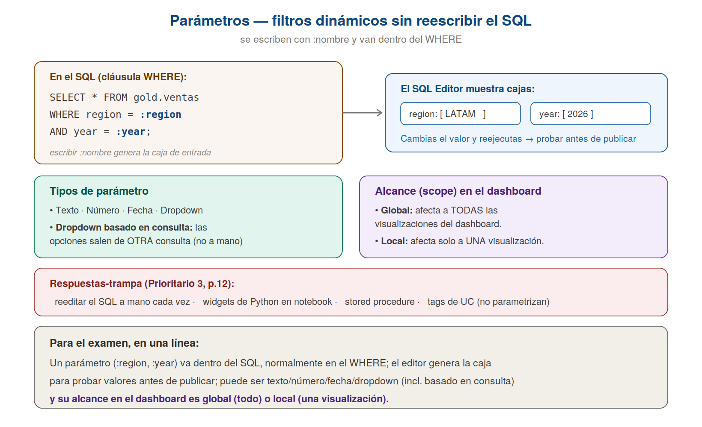

## Permisos y Compartir

Una vez armado el dashboard, hay que **distribuirlo**, y eso implica dos decisiones separadas que conviene no mezclar: **con quién** lo compartes y **qué puede hacer** cada quien (el nivel de permiso).

**Con quién / cómo compartir**, tres vías que el examen pide reconocer:

### Usuarios y grupos del workspace

Con **usuarios y grupos del workspace**: les das acceso directo por su cuenta de Databricks. Buena práctica: asignar a **grupos**, no a personas una por una, para gobernarlo mejor.

### Enlace compartible

Con un **enlace compartible**: generas un link para compartir, útil cuando quieres dar acceso de forma rápida (incluso a quienes ves de forma más amplia, según la configuración).

### Embebido en apps externas

**Embebido en apps externas**: insertas el dashboard dentro de otra aplicación o sitio web, para que se vea fuera de Databricks.


- **Qué puede hacer cada quien**, los niveles de permiso, de menor a mayor:

`CAN VIEW` → solo **ver** los resultados ya calculados. No puede reejecutar ni editar.

`CAN RUN` → además de ver, puede **ejecutar/refrescar** y usar los parámetros (cambiar filtros y correr la consulta).

`CAN EDIT` → puede **modificar** el dashboard (agregar visualizaciones, cambiar widgets).

`CAN MANAGE` → control total, incluido **gestionar los permisos** de otros.

La regla mental es que cada nivel **incluye** al anterior y suma capacidades: 

ver < ejecutar < editar < gestionar. 

El criterio de examen: si solo quieren que alguien **consuma** el tablero sin tocarlo → `CAN VIEW`; si necesita **cambiar filtros y refrescar** → `CAN RUN`; si va a **construir/modificar** → `CAN EDIT`; si administra el dashboard y sus accesos → `CAN MANAGE`. Dar más permiso del necesario rompe el principio de **mínimo privilegio**.

Un matiz que conecta con la sección de seguridad: **compartir el dashboard no salta el gobierno de los datos**. Aunque alguien tenga `CAN RUN`, **sigue sujeto a los permisos de Unity Catalog sobre las tablas** subyacentes; si no tiene `SELECT` sobre la tabla, el dashboard no le mostrará esos datos. El permiso del dashboard y el permiso del dato son **capas distintas**.

> Un dashboard se comparte con usuarios/grupos del workspace, por enlace compartible o embebido en apps externas; los niveles son `CAN VIEW` (ver) < `CAN RUN` (ejecutar/usar parámetros) < `CAN EDIT` (modificar) < `CAN MANAGE` (administrar y dar permisos), aplicando mínimo privilegio; y el acceso al dato sigue gobernado por Unity Catalog, aparte del permiso del dashboard.**

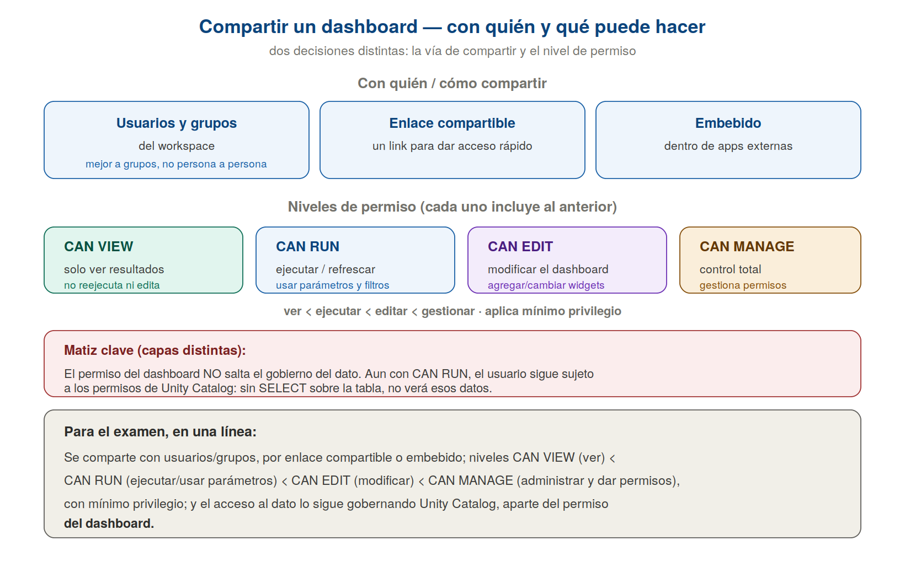


## Scheduled Refresh

- Un dashboard no se actualiza solo; muestra el resultado de la última vez que corrió. El refresco programado le pone un horario para que vuelva a ejecutar sus consultas automáticamente (cada X minutos/horas, diario, o con una expresión tipo cron) y así los datos estén frescos sin que nadie le dé clic.


- Y aquí vuelve la dependencia clave que ya vimos en el SQL Warehouse: para que el refresco programado funcione, el warehouse debe estar encendido y no haberse auto-detenido. Si está apagado por inactividad cuando llega la hora del refresco, falla. Ejemplo: "el dashboard se programó para refrescar cada 10 minutos y no funciona" → la causa es que el warehouse debe estar corriendo y sin auto-stop.

## Alerts

- Una alerta vigila una métrica y avisa cuando cruza un umbral. En vez de mirar el dashboard a cada rato, defines "si las ventas del día bajan de X, mándame un correo".
  

- Una alerta se compone de cuatro piezas que conviene tener fichadas:
  
1. Una consulta que devuelve el valor a vigilar (ej. total de ventas de hoy). 
2. Una condición / umbral (threshold): la regla que dispara la alerta (ej. > 1000, < 50). 
3. Una programación: cada cuánto se revisa la condición. 
4. Y un destino: a dónde llega el aviso (correo, webhook, etc.).


- La alerta se dispara cuando la condición se cumple (el valor cruza el umbral). Y, igual que el dashboard, necesita el warehouse encendido para correr la consulta de chequeo. 
  

- La pieza que el examen pregunta más es la combinación umbral + destino: una alerta = condición que vigilas + a quién/dónde se notifica.
  

> El refresco programado reejecuta el dashboard en un horario automático y requiere el SQL Warehouse encendido (si se auto-detiene, falla); una alerta vigila una consulta y se dispara cuando su valor cruza un umbral (threshold), notificando a un destino (email/webhook) según una programación, y también necesita el warehouse corriendo.


> Lo esencial: refresco programado = reejecuta el dashboard en un horario y exige warehouse encendido (si no, falla, como en la pregunta 22 de tu Prioritario 1); alerta = consulta + umbral + programación + destino, se dispara al cruzar el umbral. Lo más preguntado de la alerta: umbral + destino.

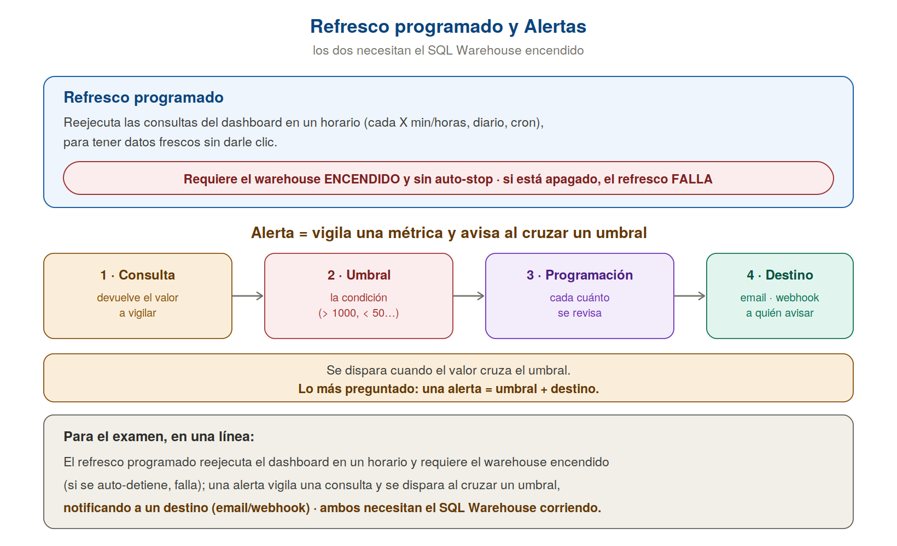

## Dashboards

**Elegir la visualización correcta**. Es de los más preguntados porque es puro criterio: te describen *qué quieren mostrar* y debes elegir *qué gráfico lo comunica mejor*. La clave es asociar **intención → gráfico**.


Cada tipo de gráfico está diseñado para responder **una pregunta distinta**. Elegir bien no es estético, es de comunicación: un mismo dato mal graficado confunde. El examen siempre te da la intención en el enunciado ("comparar", "a lo largo del tiempo", "un solo número"), y esa palabra es la pista.

El mapeo que tienes que memorizar:

### Bar
**Comparar categorías entre sí** (ventas por región, productos por unidades) → **barras** (`bar`). Es el "todoterreno" para comparar grupos.


### Line
**Mostrar una tendencia a lo largo del tiempo** (ventas mes a mes, usuarios por día) → **líneas** (`line`). Siempre que el eje sea tiempo y quieras ver evolución.


### Pie
**Mostrar proporciones de un todo** (qué % representa cada categoría del total) → **circular/pastel** (`pie`). Úsalo con pocas categorías; si son muchas, mejor barras.

### Scatter
**Ver la relación entre dos variables numéricas** (precio vs. cantidad vendida) → **dispersión** (`scatter`). Es el único pensado para correlación entre dos números.

### Counter
**Mostrar un solo valor / KPI** (ventas totales del mes, una meta, un conteo) → **counter**. Cuando la respuesta es *un número grande*, no un gráfico. Es la pregunta 10 de tu Prioritario 1.

### Pivot table
**Reorganizar y agregar por filas y columnas** (una tabla cruzada tipo Excel) → **pivot table**. Cuando quieres resumir cruzando dos dimensiones.

### Histogram
**Ver la distribución de una variable** (cómo se reparten los valores) → **histograma**. Recuerda que en notebooks la vista previa ya genera histogramas automáticos.

El truco para no fallar:
**"comparar" → barras; 
"a lo largo del tiempo / tendencia" → líneas;
"proporción / porcentaje del total" → circular; 
"un solo número / KPI / total" → counter.** 

Las preguntas-trampa suelen ofrecerte un gráfico que *técnicamente funciona* pero comunica peor (ej. un pastel con 15 categorías cuando debían ser barras), o un counter cuando piden comparar.

Y conecta con lo que ya vimos: **una misma consulta puede mostrarse en varios de estos** a la vez (barras + counter + tabla), y **dar formato** (colores, etiquetas) mejora la legibilidad, pero **el tipo de gráfico** es la decisión de fondo que comunica la historia.

> Elige el gráfico por la intención:
>  
> barras = comparar categorías, 
> líneas = tendencia en el tiempo, 
> circular = proporción del total, 
> scatter = relación entre dos numéricos, 
> counter = un solo KPI, 
> pivot = tabla cruzada, 
> histograma = distribución; 
> 
> la palabra clave del enunciado te dice cuál.

Te lo paso a imagen, que cierra la sección:Quedó con cada gráfico dibujado, su intención, el ejemplo de enunciado y los cuatro gatillos rápidos. Cierra bien la sección.Para tu resumen: `images_md/visualizacion_correcta.png` al cierre de la sección de Dashboards.

Los cuatro gatillos que tienes que disparar al instante: 
**"comparar" → barras; 
"tendencia/tiempo" → líneas; 
"proporción/% del total" → circular; 
"un solo número/KPI" → counter.**

**scatter = relación entre dos numéricos,
pivot = tabla cruzada, 
histograma = distribución.**

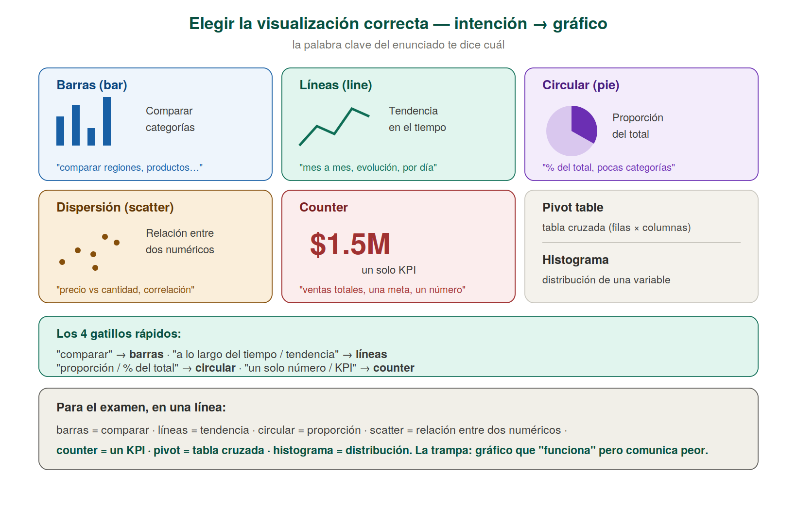

# Analizar consultas

- El hilo de esta sección es uno solo: **hacer que las consultas corran rápido y entender por qué a veces no lo hacen**. La divido en **cinco ladrillos**:

1. **Photon**: el motor que acelera el SQL.

2. **Encontrar consultas lentas**: Query History, Query Profile, Query Insights.

3. **Caching**:reutilizar resultados para no recalcular.

4. **Liquid Clustering**: organizar la tabla para filtrar rápido (reemplaza particiones y Z-order).

5. **Fix a query**: corregir el error típico de una consulta.

## Photon

Empecemos por **Photon**.

Photon es el **motor de ejecución** de Databricks, reescrito en **C++** y **vectorizado** (procesa datos en bloques, no fila por fila), que hace correr las consultas **mucho más rápido**. Es lo que está por debajo del SQL Warehouse acelerándolo. 

Lo clave: es **transparente**, no cambias tu SQL para usarlo, simplemente la consulta corre más rápido.

Dónde **brilla**: cargas analíticas típicas del analista, agregaciones (`SUM`, `GROUP BY`), joins, escaneos grandes, lecturas/escrituras en Delta y, en general, **SQL y BI**. Justamente lo que más se hace en dashboards y reportes.

> Si la pregunta menciona "acelerar consultas SQL", "motor vectorizado", "mejor rendimiento sin reescribir el código" → **Photon**. 
> 
> Y el matiz fino: Photon acelera de forma transparente, pero **no toda operación se beneficia igual**, ciertas funciones muy específicas (algunos `UDF`) pueden no acelerarse. 
> 
> Para el examen basta recordar que **Photon = velocidad transparente para SQL/BI**.

Para el examen, en una línea: **Photon es el motor vectorizado en C++ que acelera de forma transparente las consultas SQL y las cargas de BI (agregaciones, joins, escaneos) sin que reescribas el código; es la razón de la velocidad del SQL Warehouse.**

##  Encontrar consultas lentas

- Una vez que algo va lento, necesitas las herramientas para **verlo y diagnosticarlo**. Son tres, y el examen pregunta cuál usar según el caso.

### Query History
1. El **Query History** (historial de consultas) es la **lista** de todo lo que se ha ejecutado: cada consulta, quién la corrió, cuánto duró y su estado. Es tu punto de partida para **detectar** qué consulta tardó más. Responde "¿qué se ejecutó y cuánto tardó?".

### Query Profile
2. El **Query Profile** (perfil de consulta) es el **desglose detallado de UNA consulta**: muestra las etapas de ejecución, cuántos datos se leyeron, dónde se fue el tiempo y dónde está el **cuello de botella** (por ejemplo, *spilling* a disco, un escaneo enorme, un join costoso). Es **la** herramienta para *diagnosticar por qué* una consulta concreta es lenta. Responde "¿por qué esta consulta tardó tanto?".


### Query Insights
3. El **Query Insights** **señala automáticamente** las consultas con mal rendimiento, sin que tengas que buscarlas a mano. Responde "¿cuáles consultas están rindiendo mal?".

> Si piden **ver el historial / qué corrió** → Query History; 
> 
> Si piden **diagnosticar por qué una consulta es lenta / ver su ejecución y cuellos de botella** → Query Profile; 
> 
> Si piden **identificar automáticamente** las lentas → Query Insights.


Para el examen, en una línea: **para rendimiento usa Query History (lista de lo ejecutado y su duración), Query Profile (desglose de una consulta para hallar el cuello de botella) y Query Insights (señala automáticamente las consultas lentas).**

> Lo esencial: **Photon = motor vectorizado en C++ que acelera el SQL/BI sin reescribir código.** Y para diagnosticar: **Query History** (lista y duración), **Query Profile** (por qué una consulta es lenta, cuello de botella), **Query Insights** (las señala automáticamente).

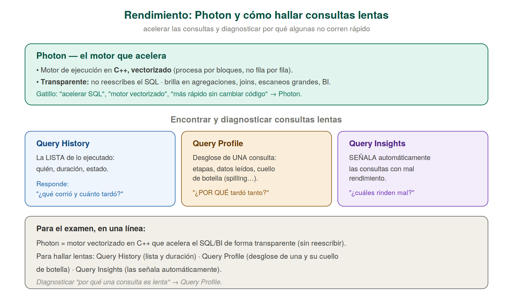


## Caching

**Caching**: reutilizar resultados ya calculados para no recalcular (reduce latencia).

- Si una consulta ya se calculó, ¿para qué recalcularla? El caché guarda resultados y los reutiliza, ahorrando tiempo y cómputo. 
  

**Hay dos tipos que conviene reconocer:**

### Result Cache
1. El result cache (caché de resultados): si vuelves a correr la misma consulta sin que cambien los datos, Databricks devuelve el resultado guardado, casi instantáneo, sin reejecutar. Es lo que hace que repetir una query en el SQL Editor sea inmediato.

   ### Disk Cache
2. El disk cache (caché de disco): guarda copias de los datos leídos en almacenamiento local rápido (SSD), para que la siguiente lectura de esa tabla no vaya hasta la nube. Acelera lecturas repetidas aunque la consulta cambie.


El punto de examen: el caché reduce latencia y costo reutilizando trabajo ya hecho; si la pregunta dice **"la misma consulta repetida es casi instantánea" → result cache**.


## Liquid Clustering

**Liquid Clustering**: organizar la tabla para filtrar rápido por columnas, **reemplaza el particionado y el Z-Ordering**, y permite **redefinir las claves sin reescribir los datos** (esto último cae mucho).


- Cuando filtras una tabla grande por una columna (WHERE region = 'LATAM'), Databricks va más rápido si los datos están organizados de modo que pueda saltarse los bloques que no le sirven. El Liquid Clustering es esa organización física por columnas clave, con CLUSTER BY.


Lo que el examen quiere que sepas, y aquí están las tres claves:


1. Reemplaza dos técnicas viejas: el particionado (PARTITION BY) y el Z-Ordering. Ya no eliges entre ellas; el Liquid Clustering es la forma moderna y recomendada para tablas Delta nuevas.
2. Acelera el filtrado por las columnas clave (lecturas selectivas, data skipping).
3. Y la ventaja estrella (la que más cae): puedes redefinir las claves de clustering sin reescribir los datos existentes. Con el particionado tradicional, cambiar la estrategia obligaba a reescribir toda la tabla; con Liquid Clustering, cambias las claves y listo, sin reorganizar lo ya guardado. Es flexible donde el particionado era rígido.


>El gatillo de examen: "mejorar el filtrado de una tabla grande sin reescribir los datos", o "reemplazo de particiones y Z-order" → Liquid Clustering.

> El caché reutiliza trabajo ya hecho, result **cache** (misma consulta = resultado guardado) y **disk cache** (datos en SSD local), reduciendo latencia; el **Liquid Clustering** organiza la tabla por columnas clave (CLUSTER BY) para filtrar rápido, reemplaza partición y Z-Ordering, y permite redefinir las claves sin reescribir los datos.

Lo esencial: caché = reutilizar trabajo (result cache: misma consulta = resultado guardado; disk cache: datos en SSD); 

Liquid Clustering = organizar por columnas clave con CLUSTER BY, reemplaza partición y Z-order, y redefine claves sin reescribir datos. 

El gatillo clave: "filtrar tabla grande sin reescribir" → **Liquid Clustering**.


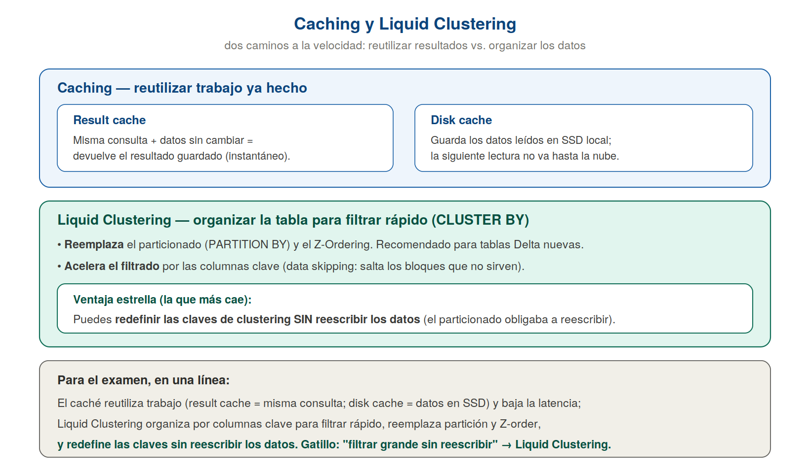

- NOTA: No uses `PARTITIONED BY`, `ZORDER` ni una cláusula inventada, por ejemplo, `LIQUID CLUSTERING`.
  

- Estrutura de uso:
```sql
CREATE TABLE sales (...) CLUSTER BY (region, sale_date);
OPTIMIZE sales;   -- materializa el nuevo layout
```


## Fix a Query

- **Fix a Query** (corregir una consulta). El examen te muestra un SQL que **falla o da un resultado raro** y pide identificar el error. No es teoría: es reconocer **patrones de error frecuentes**. Estos son los que más caen.

### GROUP BY
1. El **`GROUP BY` faltante** es el rey. Si seleccionas una columna normal junto a un agregado (`SELECT region, SUM(monto)`) **sin** agrupar por esa columna, la consulta **falla**. 

La corrección: toda columna no agregada va en el `GROUP BY` (`GROUP BY region`). 

### Filtrar un agregado con WHERE
2. **Filtrar un agregado con `WHERE`** en lugar de `HAVING`. No puedes escribir `WHERE SUM(monto) > 1000`: los agregados no se pueden filtrar en `WHERE`. 

La corrección es usar `HAVING` (Prioritario 2, pregunta 28). Pista: si el filtro es sobre un `SUM`/`COUNT`/`AVG`, va en `HAVING`.

### Comparar con NULL usando
3. **Comparar con `NULL` usando `=`**. `WHERE col = NULL` **nunca** es verdadero (porque NULL es "desconocido") y no devuelve filas. 

La corrección: `IS NULL` / `IS NOT NULL`. Es un "resultado raro" típico: la consulta corre pero no trae nada.

### Conteo inflado por duplicados o por un join
4. **Conteo inflado por duplicados o por un join.** Si un `COUNT` o `SUM` sale más alto de lo esperado, suele ser por **filas duplicadas** (faltó `DISTINCT`/dedup) o por un **fan-out del join** (la clave no era única y multiplicó filas). 

La corrección: deduplicar o revisar la clave del join.

### Orden lógico mal entendido
5. **Orden lógico mal entendido.** Recuerda la secuencia: 
`FROM/JOIN → WHERE → GROUP BY → HAVING → SELECT → ORDER BY → LIMIT`. 

Muchos errores vienen de intentar usar algo antes de que "exista" (por ejemplo, filtrar por un alias del `SELECT` en el `WHERE`, cuando el `SELECT` se evalúa después).

La estrategia de examen, en una frase: 

Cuando veas una consulta a corregir, **revisa en este orden**: 
¿toda columna no agregada está en el `GROUP BY`?
→ ¿se está filtrando un agregado con `WHERE` en vez de `HAVING`? 
→ ¿hay un `= NULL`? 
→ ¿el conteo se infló por duplicados/join? 
La mayoría de los "fix a query" caen en uno de estos.

> Los errores típicos a corregir son: columna no agregada fuera del `GROUP BY` (falla), filtrar un agregado con `WHERE` en vez de `HAVING`, comparar con `= NULL` en lugar de `IS NULL`, y conteos inflados por duplicados o fan-out de join; revísalos en ese orden.


Los cuatro patrones a revisar en orden: 
→ Columna no agregada fuera del `GROUP BY` 
→ Agregado filtrado con `WHERE` (usar `HAVING`) 
→ `= NULL` (usar `IS NULL`) 
→ Conteo inflado por duplicados/join.


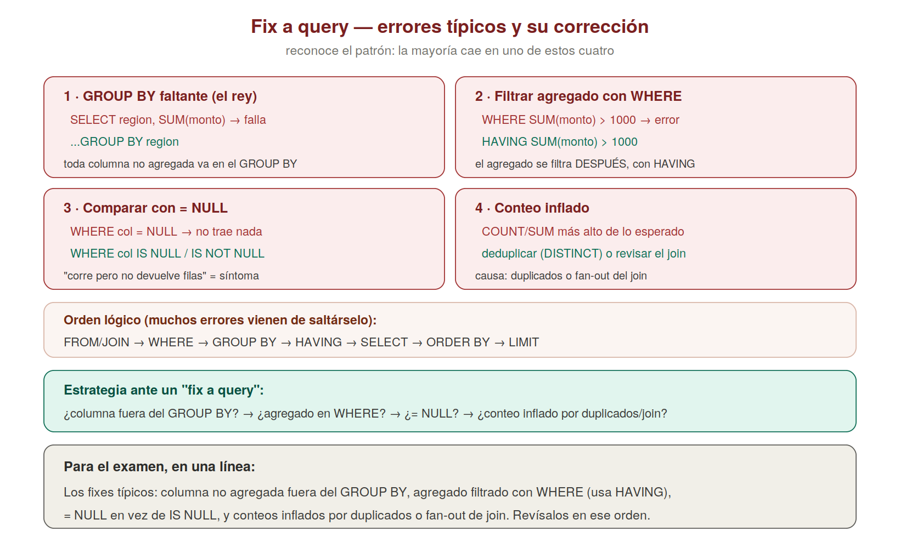

# Genie

Hay que entender **qué es Genie, de qué se compone y cómo se mantiene afinado**. Dividido en **tres ladrillos**:

1. **Qué es y sus componentes**: cómo se arma un espacio Genie.

2. **Permisos y distribución**: cómo se comparte.

3. **Optimización / mantenimiento**: cómo se mejora con el tiempo.

## Qué es Genie y sus componentes

Un **espacio Genie (AI/BI Genie)** es un lugar donde los usuarios de negocio hacen **preguntas en lenguaje natural** ("¿cuáles fueron las ventas de LATAM el mes pasado?") y Genie **genera el SQL y responde** sobre datos **curados** de Unity Catalog. Es autoservicio de datos para gente que no escribe SQL. Por debajo se apoya en el **Data Intelligence Engine** (lo que le da el contexto de los datos).

Para crear un espacio Genie defines **cinco componentes**, y el examen pregunta justo cuáles son y para qué sirve cada uno:

### SQL Warehouse
1. Un **SQL Warehouse**: el cómputo que ejecutará las consultas que Genie genere (sin warehouse, no responde).

### Datasets curados de Unity Catalog
2. Los **datasets curados de Unity Catalog**: eliges las **tablas y vistas** sobre las que Genie puede responder. Acotas su universo a datos confiables.

### Sample questions
3. Las **sample questions** (preguntas de ejemplo): ejemplos de preguntas razonables que **orientan** al usuario y a Genie sobre qué se puede preguntar.

### Instrucciones de dominio
4. Las **instrucciones de dominio** (general/domain instructions): contexto del negocio en lenguaje natural, definiciones, reglas, qué significa cada término. Es donde le "enseñas" el vocabulario de tu empresa (qué es "cliente activo", cómo se calcula "margen").

### Trusted Assets
5. Los **Trusted Assets** (activos de confianza): **consultas o funciones SQL ya verificadas** que Genie puede reutilizar con seguridad. Cuando una pregunta es delicada o frecuente, no dejas que Genie improvise: le das la consulta correcta validada. Es la pieza que **garantiza precisión** en lo importante.


Un detalle que conecta con la sección de gestión de datos: Genie se apoya mucho en los **metadatos**, los **comentarios de tablas y columnas** en Unity Catalog. Cuanto mejor descritos estén tus datos, mejor entiende Genie el dominio. Por eso "documentar/comentar las tablas" mejora a Genie.

> Un espacio Genie responde preguntas en lenguaje natural generando SQL sobre datos curados de Unity Catalog; se crea con cinco piezas, un SQL Warehouse, datasets curados de UC, sample questions, instrucciones de dominio y Trusted Assets (consultas verificadas que aseguran precisión), y se apoya en los comentarios/metadatos de las tablas.

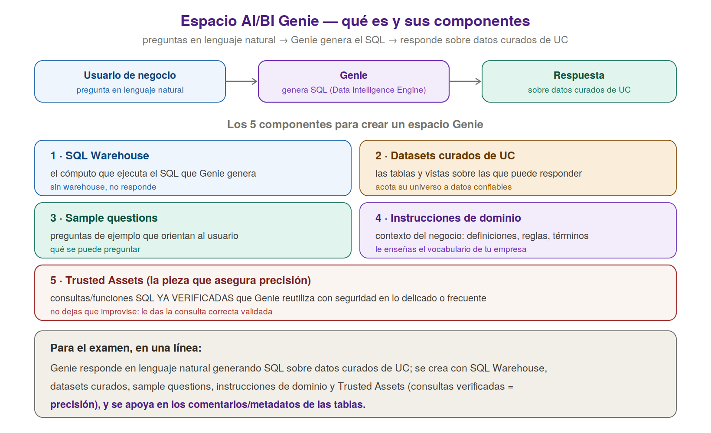

## Permisos y Distribución

Una vez creado el espacio, hay que **dar acceso** a los usuarios de negocio que lo van a usar y **hacérselo llegar** a donde trabajan. Igual que con dashboards, son dos cosas: **a quién das permiso** y **cómo lo distribuyes**.

### Permisos
**Permisos**: se asignan **desde la UI** del espacio, a **usuarios y grupos** del workspace (buena práctica: a grupos). Definen quién puede usar el espacio y en qué nivel (consumir/preguntar vs. editar/administrar la configuración del espacio).

### Distribución
**Distribución**: el espacio Genie se puede **distribuir mediante enlaces embebidos** para integrarlo en **aplicaciones externas** o portales internos, de modo que la gente pregunte desde donde ya trabaja, sin entrar a Databricks. Es el mismo patrón que viste en dashboards (compartir / embeber).

**Y el matiz de gobierno que el examen valora, idéntico al de dashboards: dar acceso al espacio Genie no salta el gobierno de Unity Catalog. Aunque alguien pueda usar el espacio, solo verá los datos sobre los que tiene permisos en UC. El permiso del espacio y el permiso del dato son capas distintas; Genie respeta siempre los controles de Unity Catalog sobre las tablas.**

> Un espacio Genie se comparte por la UI con usuarios/grupos y se distribuye mediante enlaces embebidos en apps externas; el acceso al espacio no sustituye al gobierno de Unity Catalog, que sigue controlando qué datos ve cada usuario.**


> Permisos por la UI a usuarios/grupos; distribución por enlaces embebidos en apps externas; y Unity Catalog sigue gobernando qué datos ve cada usuario (el acceso al espacio no salta el gobierno del dato).

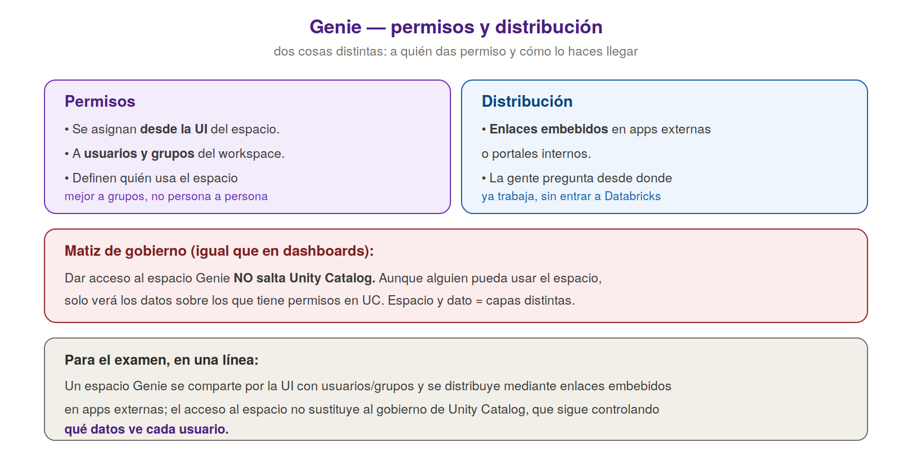

## Optimización / Mantenimiento 

Un espacio Genie no se crea y se olvida: se afina con el uso para que responda cada vez mejor. El examen pregunta qué acciones lo mejoran.

- Genie aprende del feedback y de un dominio bien descrito. Mantenerlo es un ciclo de:
medir → ajustar → volver a medir. 

- Estas son las acciones que el examen quiere que asocies a "mejorar/optimizar Genie":

### Monitorear el uso real
1. Monitorear el uso real: seguir qué preguntas hacen los usuarios, con qué precisión responde Genie y el feedback (pulgar arriba/abajo). Es el "medir": detectas dónde falla.

### Refinar instrucciones y Trusted Assets
2. Refinar instrucciones y Trusted Assets: con base en lo que detectaste, ajustas las instrucciones de dominio (aclaras definiciones, agregas contexto) y añades/corriges Trusted Assets (consultas verificadas) para las preguntas que salían mal o son frecuentes. Es el "ajustar", y es la palanca principal: si Genie se equivoca seguido en cierto cálculo, le das la consulta correcta como Trusted Asset.

### Validar con benchmarks
3. Validar con benchmarks: comprobar la precisión contra un conjunto de preguntas de referencia, para confirmar que los cambios mejoraron y no empeoraron. Es el "volver a medir".
   
### Refrescar los metadatos de Unity Catalog
4. Refrescar los metadatos de Unity Catalog: como Genie se apoya en los comentarios de tablas/columnas y el esquema, si los datos cambian o documentas mejor, refrescar/actualizar esos metadatos mejora su comprensión del dominio. Documentar bien las tablas es, en sí, optimizar Genie.


El gatillo de examen: si la pregunta dice "Genie responde mal con frecuencia, ¿qué haces para mejorarlo?" → la respuesta combina refinar instrucciones y Trusted Assets y revisar el feedback / refrescar metadatos, no "reentrenar el modelo" ni "cambiar de warehouse" (distractores típicos).

> Optimizar Genie es un ciclo de medir y ajustar: monitorear preguntas, precisión y feedback; refinar las instrucciones de dominio y los Trusted Assets; validar con benchmarks; y refrescar los metadatos/comentarios de Unity Catalog para que entienda mejor el dominio.

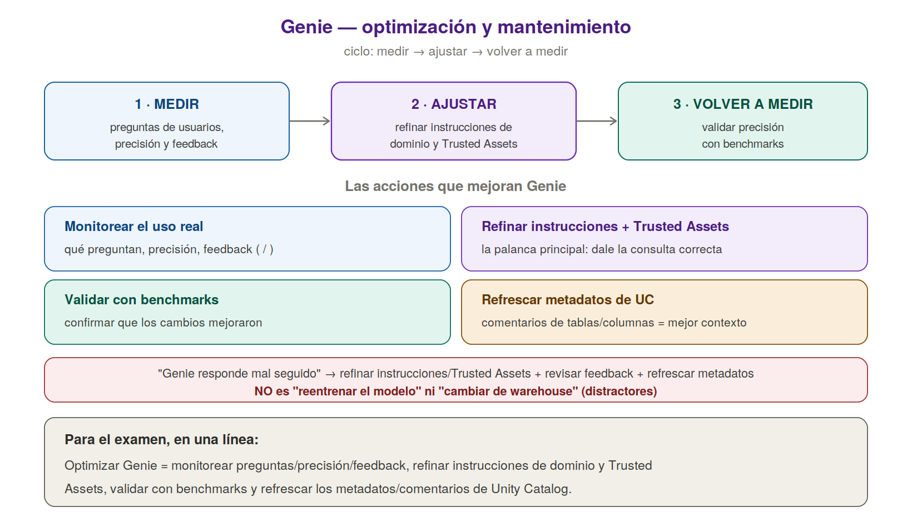

# Plataforma Databricks

Es bastante conceptual: reconocer **qué es cada pieza de la plataforma** y para qué sirve. Aquí la ordenada como **tres ladrillos**:

1. **Los componentes núcleo**: los nombres que debes reconocer.

2. **Catalog Explorer**: la interfaz para descubrir y gobernar.

3. **Marketplace y Partner Connect**: obtener y conectar datos/herramientas.

## Los componentes núcleo

- Databricks es la **Data Intelligence Platform**, construida como un **Lakehouse**. Sobre esa base hay un conjunto de componentes con nombre propio, y el examen pregunta **qué hace cada uno** (no a fondo, sino para identificarlos). Estos son los que debes reconocer:

### Delta Lake
`Delta Lake` → el **formato de almacenamiento** abierto (sobre Parquet) con transacciones ACID, time travel e historial. *Todas las tablas son Delta por defecto.*

### Unity Catalog
`Unity Catalog` → la capa de **gobierno**: permisos, linaje, descubrimiento y el namespace de 3 niveles.

### Databricks SQL
`Databricks SQL` → el **servicio de análisis con SQL**: editor, SQL Warehouses, dashboards.

### Photon
`Photon` → el **motor vectorizado** que acelera el SQL/BI.

### Mosaic AI
`Mosaic AI` → la parte de **IA/ML** de la plataforma (modelos, GenAI).

### Delta Live Tables
`Delta Live Tables (DLT)` / Lakeflow Declarative Pipelines → framework **declarativo de ETL** (defines el resultado, Databricks gestiona el pipeline). Más de Data Engineer, pero hay que saber qué es.

### Lakeflow Jobs
`Lakeflow Jobs` → **orquestación** de trabajos y pipelines (agendar, encadenar tareas).

### Data Intelligence Engine
`Data Intelligence Engine` → la capa de **IA que entiende tus datos** (potencia Genie y el Assistant).

> El criterio de examen es de **emparejamiento**: 
> 
> Te describen una función y eliges el componente. Por ejemplo, "gobierno y permisos" → Unity Catalog; "acelera consultas" → Photon; "ETL declarativo" → DLT; "almacenamiento con ACID y time travel" → Delta Lake; "IA/ML" → Mosaic AI. 
> 
> La trampa habitual es confundir el **gobierno** (Unity Catalog) con el **almacenamiento** (Delta Lake), o atribuir a Databricks SQL lo que hace Photon.

> Reconoce cada componente por su función:
> Delta Lake (almacenamiento ACID + time travel), 
> Unity Catalog (gobierno y namespace),
> Databricks SQL (análisis SQL/warehouses/dashboards), 
> Photon (motor que acelera), 
> Mosaic AI (IA/ML), 
> DLT (ETL declarativo), 
> Lakeflow Jobs (orquestación),
> Data Intelligence Engine (la IA que entiende los datos).


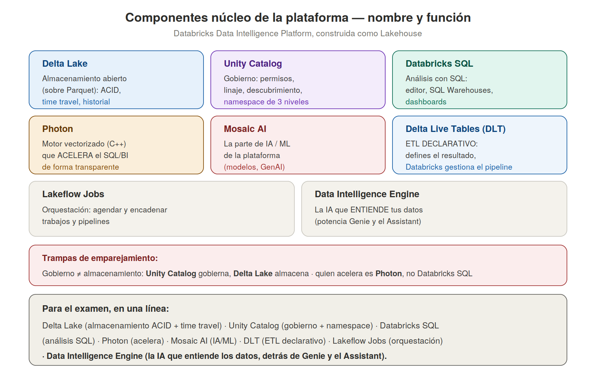


## Catalog Explorer

- Es la interfaz que el analista usa más para "moverse" por los datos.

- El Catalog Explorer (a veces "Data Explorer") es la **ventana visual a Unity Catalog**. Es donde **navegas, descubres y gobiernas** los datos sin escribir SQL: ves qué existe, de qué se trata, quién es el dueño y de dónde viene. 
  
- Si Unity Catalog es el "gobierno", el Catalog Explorer es la **pantalla** desde la que lo operas.

Qué puedes hacer ahí, que es justo lo que el examen pregunta:

1. **Navegar el namespace de 3 niveles**: recorrer catálogos → esquemas → tablas/volúmenes, como un árbol de carpetas.

2. **Previsualizar y ver metadatos de una tabla**: su **esquema** (columnas y tipos), una **muestra de datos** (sample data), el **dueño** (owner) y los **permisos**. Ejemplo: "ver una tabla con su dueño, permisos y esquema" → **Catalog Explorer**, no correr una query.

4. **Ver el linaje (lineage)**: de dónde viene el dato y a dónde va, **a nivel de tabla y de columna**, incluyendo notebooks, jobs y dashboards que lo usan. Sirve para rastrear el origen y el impacto de un cambio.

5. **Reconocer tablas certificadas (certified)**: las marcadas como confiables/curadas por el equipo de datos,las que tú, como analista, debes consumir.

6. **Etiquetar (tags) y comentar**: añadir tags (ej. marcar columnas como `PII`) y comentarios que describen el dato. Esto conecta con Genie (que se apoya en esos comentarios) y con la gobernanza (los tags habilitan reglas por atributo).

El criterio de examen es de **herramienta correcta**: si la pregunta dice "previsualizar una tabla, ver su esquema/dueño/permisos sin ejecutar SQL" → **Catalog Explorer**. Si dice "ver de dónde viene el dato" → **linaje en el Catalog Explorer**. Las trampas suelen ofrecer "correr un `SELECT`" o "abrir un notebook" cuando lo que se pide es justo la inspección visual.

> El Catalog Explorer es la interfaz visual de Unity Catalog para navegar el namespace, previsualizar tablas (esquema, muestra, dueño, permisos), ver el linaje a nivel de tabla y columna, reconocer tablas certificadas y aplicar tags/comentarios; es la herramienta para inspeccionar datos sin escribir SQL.


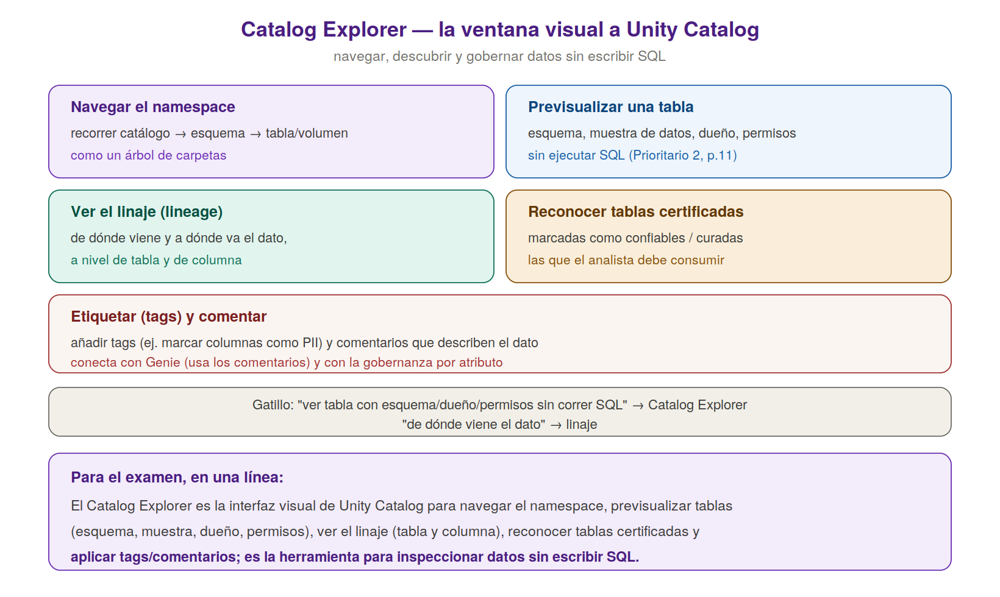


## Marketplace y Partner Connect

- Son dos cosas distintas que conviene no confundir: una trae **datos** de fuera, la otra conecta **herramientas** de fuera.

### Databricks Marketplace

La **idea raíz**: es un **mercado abierto** para **descubrir y obtener productos de datos** ya listos, datasets, notebooks, modelos de ML, de proveedores externos, sin montar ingestas. En vez de buscar y cargar un dataset público (clima, demografía, finanzas), lo tomas del Marketplace y aparece en tu Unity Catalog listo para consultar.

El detalle técnico que cae: por debajo, el Marketplace funciona con **Delta Sharing**, el protocolo abierto para compartir datos **sin replicarlos**. Por eso obtener un producto del Marketplace es seguro y gobernado: no copias archivos, accedes al dato compartido. 

> Gatillo de examen: "obtener un dataset externo ya curado para análisis" → **Marketplace**.

### Partner Connect

- Es el lugar para **conectar herramientas de terceros** a Databricks con **pocos clics**, sin configurar conexiones a mano. Cubre las herramientas del ecosistema de datos: **BI** (Power BI, Tableau), **ingesta/ETL** (Fivetran), **transformación** (dbt), entre otras. 
  
- Partner Connect crea automáticamente lo necesario (el recurso de cómputo, las credenciales) para que esa herramienta hable con Databricks.

La distinción clave que el examen quiere: **Marketplace = obtener datos; Partner Connect = conectar herramientas.** Si la pregunta dice "conectar Power BI o Tableau a Databricks fácilmente" → **Partner Connect**; si dice "encontrar y traer un dataset listo" → **Marketplace**.

> El Marketplace sirve para descubrir y obtener productos de datos externos (datasets, notebooks, modelos) usando Delta Sharing por debajo (sin replicar); Partner Connect sirve para conectar herramientas de terceros (Power BI, Tableau, Fivetran, dbt) con pocos clics. Datos → Marketplace; herramientas → Partner Connect.

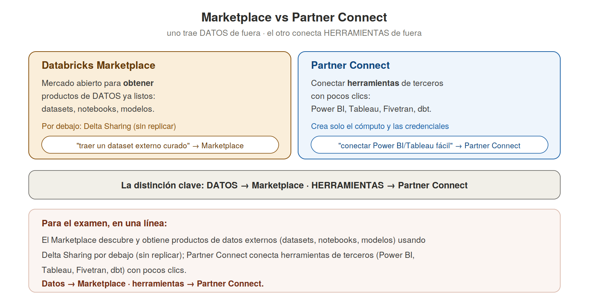

# Asegurar Datos

Toda gira en torno a **Unity Catalog como capa de gobierno**. La dividimos en **cuatro ladrillos**:

1. **El namespace de 3 niveles**: cómo se nombra y organiza todo.

2. **Roles, privilegios y propiedad**: `GRANT`/`REVOKE`, la cadena de permisos, ownership.

3. **Proteger PII**: column masks, row filters, dynamic views, tags.

4. **Auditoría**: quién accede a qué.

## Roles, privilegios y propiedad

En Unity Catalog, **nadie ve nada por defecto**; el acceso se **concede explícitamente**. Y como todo vive en el namespace de 3 niveles, el permiso también es **jerárquico**: para llegar a una tabla necesitas permiso en cada nivel del camino.

1. **Conceder y revocar** se hace con SQL estándar: `GRANT <privilegio> ON <objeto> TO <principal>` y `REVOKE ...`. El "principal" es un usuario o, mejor, un **grupo**.

2. Los **privilegios** que conviene reconocer: `USE CATALOG` (entrar a un catálogo), `USE SCHEMA` (entrar a un esquema), `SELECT` (leer una tabla), `MODIFY` (escribir/cambiar datos), `CREATE` (crear objetos), y `ALL PRIVILEGES` (todos).

Y aquí está **la cadena de permisos**, que es lo que más cae: para que alguien pueda hacer un `SELECT` sobre `ventas.publico.clientes`, **no basta** con darle `SELECT` sobre la tabla. Necesita los tres eslabones: `USE CATALOG` sobre `ventas` **+** `USE SCHEMA` sobre `publico` **+** `SELECT` sobre `clientes`. Si le falta cualquiera de los de arriba, no llega a la tabla aunque tenga el `SELECT`. 

> La regla: **el permiso recorre el namespace de arriba hacia abajo.**

- La **propiedad (ownership)**: cada objeto tiene un **dueño** con control total sobre él (puede gestionar permisos y transferir la propiedad). 

- La buena práctica de examen: que el dueño sea un **grupo**, no una persona, para que el acceso no dependa de un individuo. Y el principio que rige todo: **mínimo privilegio**, dar solo el acceso necesario, ni más.

> Unity Catalog concede acceso explícito con `GRANT`/`REVOKE`; los privilegios son `USE CATALOG`, `USE SCHEMA`, `SELECT`, `MODIFY`, `CREATE`, `ALL PRIVILEGES`; para leer una tabla hace falta la cadena completa (`USE CATALOG` + `USE SCHEMA` + `SELECT`); cada objeto tiene un dueño (mejor un grupo) y rige el mínimo privilegio.

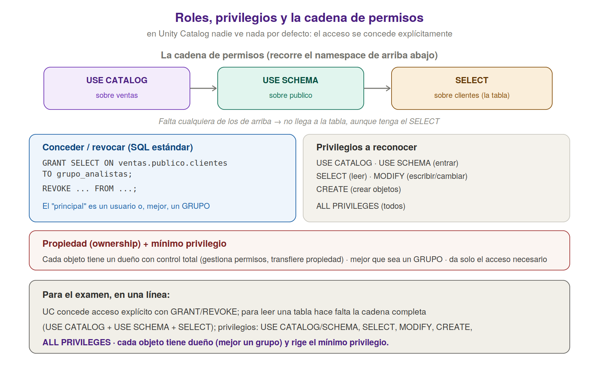


Lo esencial: acceso explícito con GRANT/REVOKE; para leer una tabla hace falta la cadena USE CATALOG + USE SCHEMA + SELECT; privilegios USE CATALOG/SCHEMA, SELECT, MODIFY, CREATE, ALL PRIVILEGES; cada objeto tiene dueño (mejor un grupo) y rige el mínimo privilegio.

##  Proteger PII 

**Proteger PII** (datos personales: nombres, correos, números de tarjeta…).

- A veces no quieres dar o quitar acceso a **toda** una tabla, sino controlar **qué partes** ve cada quien. Un analista de marketing puede ver la tabla de clientes, pero **no** la columna `tarjeta_credito`, o solo las filas de **su** región. Unity Catalog ofrece controles **finos**, a nivel de columna y de fila, para eso. Hay cuatro herramientas, y el examen pregunta cuál encaja en cada situación.

### Column masks
1. **Column masks (máscaras de columna)**: enmascaran el **valor de una columna** según quién consulta. El de marketing ve `****` en `tarjeta_credito`; el de finanzas ve el número real. La tabla es la misma; **el valor se oculta por columna y por usuario**. Se implementan con una **función (UDF)** que decide qué mostrar.

### Row filters
2. **Row filters (filtros de fila)**: limitan **qué filas** ve cada usuario. El gerente de LATAM solo ve las filas de LATAM; el de EMEA solo las suyas. **Misma consulta, distinto subconjunto de filas** según quién pregunta. También vía UDF.

### Dynamic views
3. **Dynamic views (vistas dinámicas)**: una **vista** que incorpora esa lógica de seguridad con `CASE` sobre el usuario o grupo (`current_user()`, `is_account_group_member()`). Sirve para **ocultar/enmascarar columnas o filas** de forma condicional. Es la opción "todo en uno" cuando defines la seguridad dentro de una vista que los usuarios consultan.

### Tags + ABAC
4. **Tags + ABAC (control por atributo)**: en vez de proteger columna por columna, **etiquetas** las columnas sensibles como `PII` y aplicas una **regla por ese atributo** (Attribute-Based Access Control). Escala mejor: una política para "todo lo etiquetado PII".

> Si piden **ocultar el valor de una columna** (enmascarar) → **column mask** (o dynamic view); si piden **limitar las filas que ve cada usuario** → **row filter** (o dynamic view); si la lógica de seguridad va **dentro de una vista** que consultan → **dynamic view**; si piden **gobernar todas las columnas PII con una sola regla** → **tags + ABAC**. La distinción columna vs. fila es la que más cae: **mask = columna; filter = fila.**

- Estos controles **viven en Unity Catalog** y se aplican **por encima** de los permisos de tabla; alguien puede tener `SELECT` sobre la tabla y aun así ver datos enmascarados o filas filtradas. Recuerda también que la **dynamic view** ya la fichaste en la sección de vistas como "la de seguridad", frente a la materialized (rendimiento).

> Para proteger PII sin quitar la tabla entera: column masks ocultan valores por columna y usuario, row filters limitan las filas por usuario (ambos vía UDF), las dynamic views meten esa lógica de seguridad dentro de una vista (con `CASE`/`current_user`), y los tags + ABAC gobiernan todas las columnas etiquetadas PII con una sola regla; recuerda: mask = columna, filter = fila.


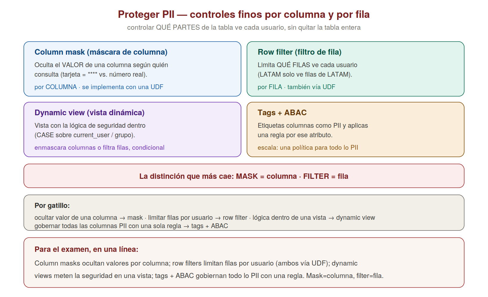


## Auditoría

- Gobernar no es solo **dar y quitar** permisos, también es **saber qué pasó**: quién consultó qué tabla, cuándo, y qué acciones se hicieron. Unity Catalog **registra esa actividad automáticamente**, y eso es lo que permite **rastrear, investigar y cumplir** con normativas (saber si alguien accedió a datos sensibles, por ejemplo).

Las dos piezas que conviene reconocer:

### audit logs
1. Los **audit logs (registros de auditoría)**: el registro de **eventos de acceso y acciones**, quién hizo `SELECT`, quién cambió permisos, quién creó o borró objetos, con su usuario y marca de tiempo. Es el "quién hizo qué y cuándo".

### system tables
2. Las **system tables (tablas de sistema)**: Databricks expone esa información operativa y de gobierno en **tablas que puedes consultar con SQL** (acceso, linaje, uso, facturación). Es decir, **auditas con consultas normales**, no con una herramienta aparte. Por ejemplo, puedes consultar quién accedió a una tabla en el último mes.

- Y conviene ubicar la diferencia con el **linaje**, que ya viste: el **linaje** responde "¿de dónde viene y a dónde va el dato?" (el flujo); la **auditoría** responde "¿quién lo tocó y cuándo?" (el acceso). 

- Son complementarios: linaje = trayectoria del dato; auditoría = actividad de las personas.

> Si la pregunta dice "rastrear **quién accedió** a una tabla / registrar la actividad / cumplimiento" → **auditoría (audit logs / system tables)**. Si dice "de dónde **proviene** el dato" → linaje.

> Unity Catalog audita automáticamente la actividad mediante audit logs y system tables (consultables con SQL), registrando quién accedió a qué y cuándo, para rastreo y cumplimiento; la auditoría responde "quién tocó el dato", frente al linaje que responde "de dónde viene".


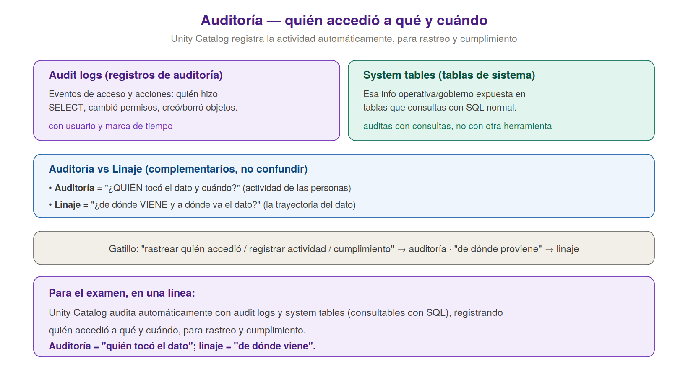

# Managing Data

1. **Descubrir y consumir datasets certificados**: usar Unity Catalog para encontrar los datos confiables.

2. **Etiquetar y ver linaje**: organizar y rastrear (ya visto en Catalog Explorer).

3. **Limpieza en SQL**: dejar el dato usable (ya visto en Silver).

## Descubrir y consumir datasets certificados

- El trabajo del analista **empieza por encontrar el dato correcto**, no por crearlo. Unity Catalog (vía Catalog Explorer) es donde **descubres** qué tablas existen, las **buscas**, y eliges las **certificadas**, marcadas como confiables y curadas por el equipo de datos. 
  
- La regla de rol: tú **consumes** datasets certificados (Silver/Gold), no construyes pipelines.

## Etiquetar y linaje

- Aplicas **tags** (ej. marcar columnas como `PII`) para organizar y gobernar, y consultas el **linaje** para saber de dónde viene un dato y qué se vería afectado por un cambio. Ambos se hacen en el **Catalog Explorer**.

## Limpieza en SQL

- Ya se vio en Silver:

Quitar **datos inválidos**: filtrar con `WHERE`, descartar lo que no cumple.

Manejar **valores faltantes** (nulos): `COALESCE(col, valor)` / `IFNULL` para rellenar, `WHERE col IS NOT NULL` para descartar, recordando que se detecta con `IS NULL` (nunca `= NULL`).

Quitar **duplicados**: `DISTINCT` o `GROUP BY`.

El criterio de examen de esta sección es de **flujo de trabajo del analista**: descubrir el dato certificado → entenderlo (esquema, linaje) → limpiarlo si hace falta → analizarlo. Si la pregunta describe "encontrar y usar datos confiables ya curados" → datasets certificados en Unity Catalog; "organizar/clasificar columnas sensibles" → tags; "quitar nulos/duplicados/inválidos" → las funciones de limpieza SQL.

> Gestionar datos es el flujo del analista en Unity Catalog: descubrir y consumir datasets certificados (confiables y curados), etiquetarlos (tags) y ver su linaje en el Catalog Explorer, y limpiarlos en SQL (quitar inválidos con `WHERE`, nulos con `COALESCE`/`IS NULL`, duplicados con `DISTINCT`).**

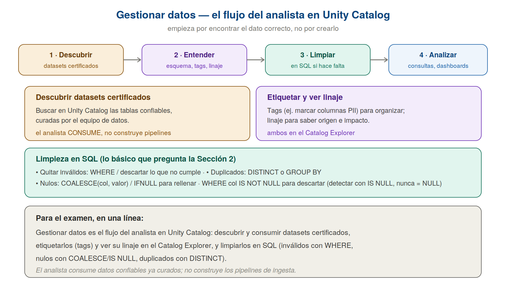

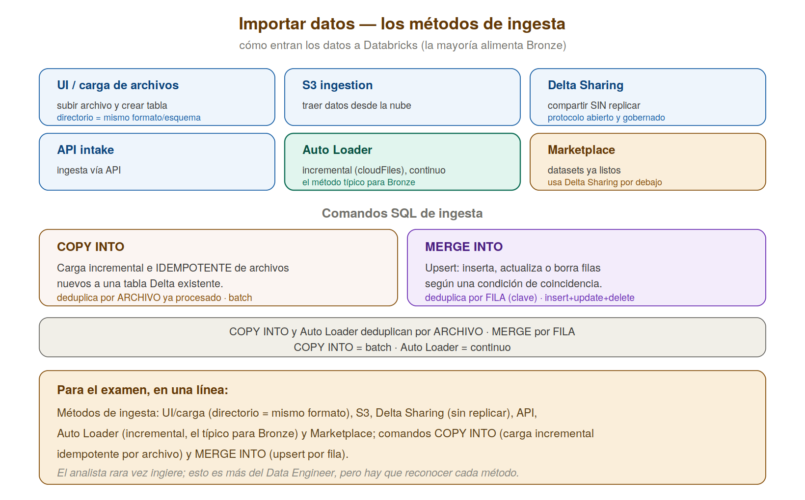


# Resumen
## Section 1: Understanding of Databricks Data Intelligence Platform 
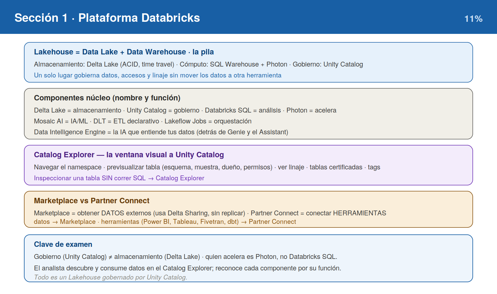


## Section 2: Managing Data 
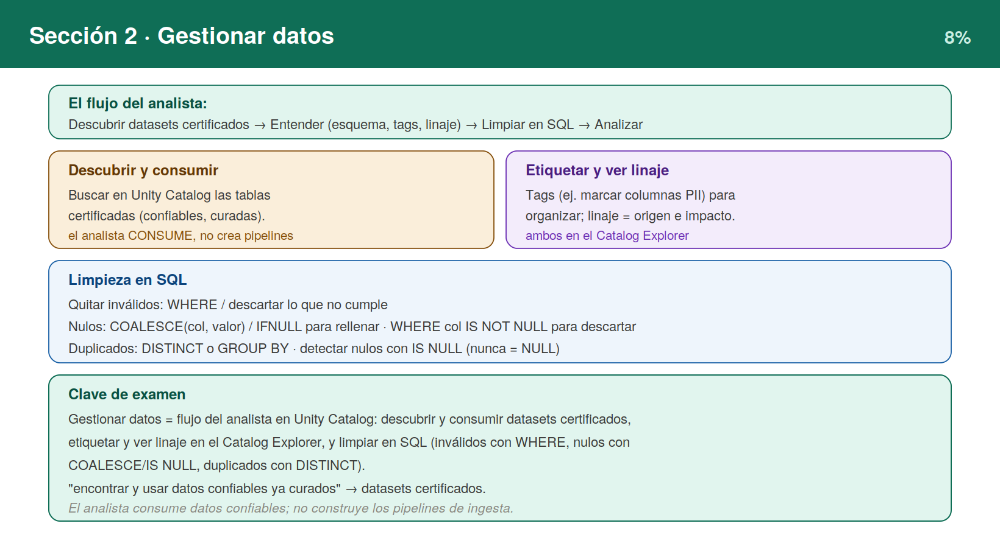


## Section 3: Importing Data 
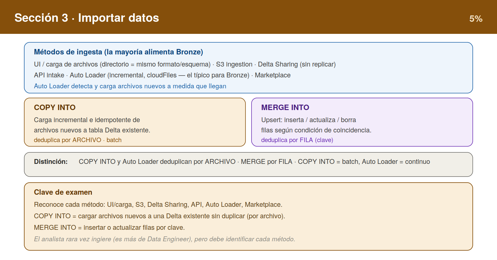


## Section 4: Executing queries using Databricks SQL and Databricks SQL Warehouses
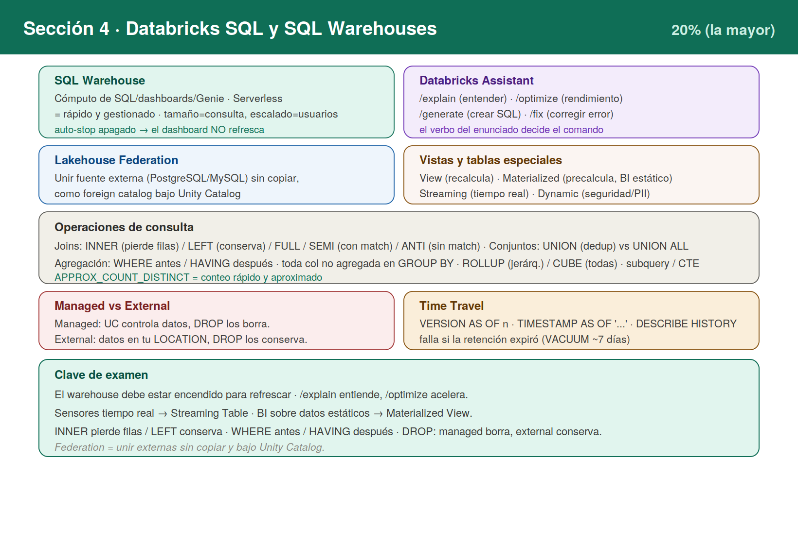


## Section 5: Analyzing Queries 
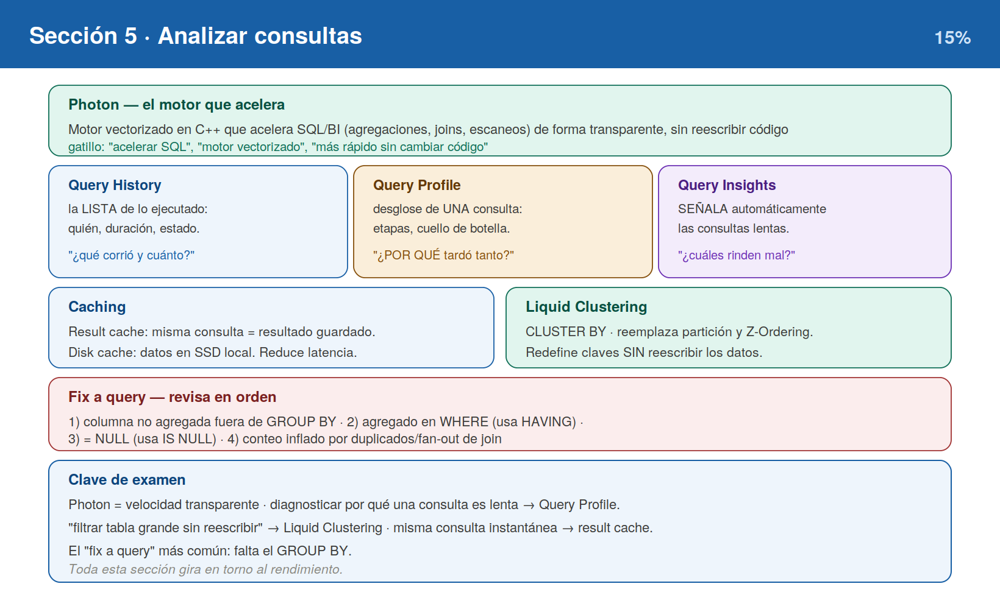


## Section 6: Working with Dashboards and Visualizations in Databricks 
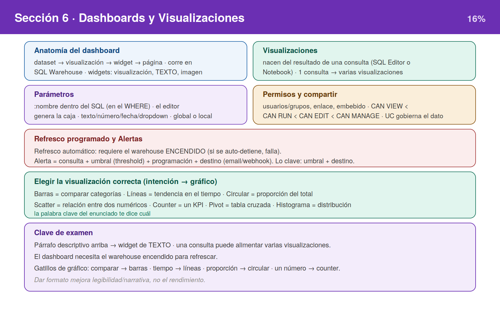


## Section 7: Developing, Sharing, and Maintaining AI/BI Genie spaces
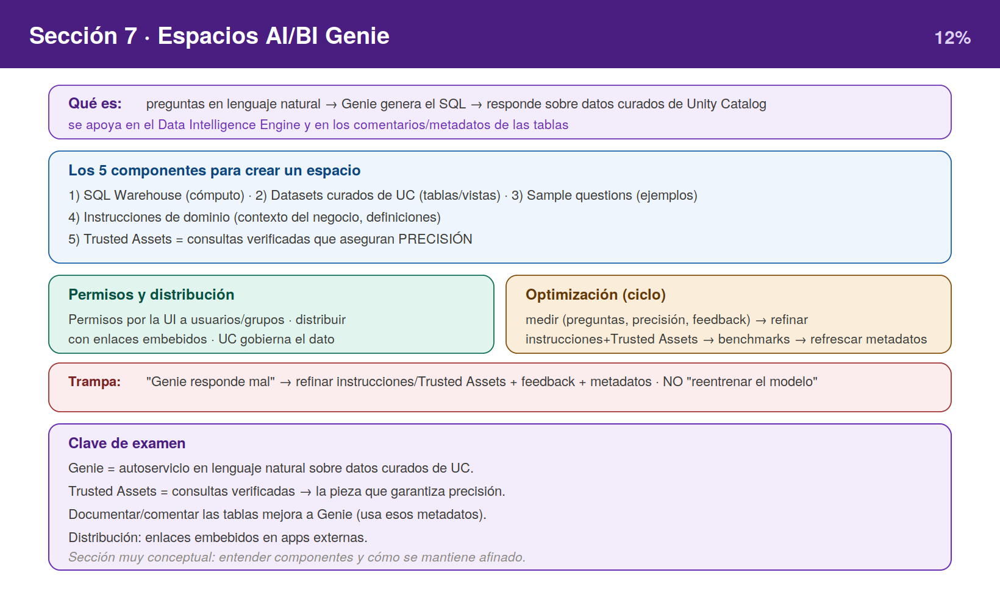


## Section 8: Data Modeling with Databricks SQL 
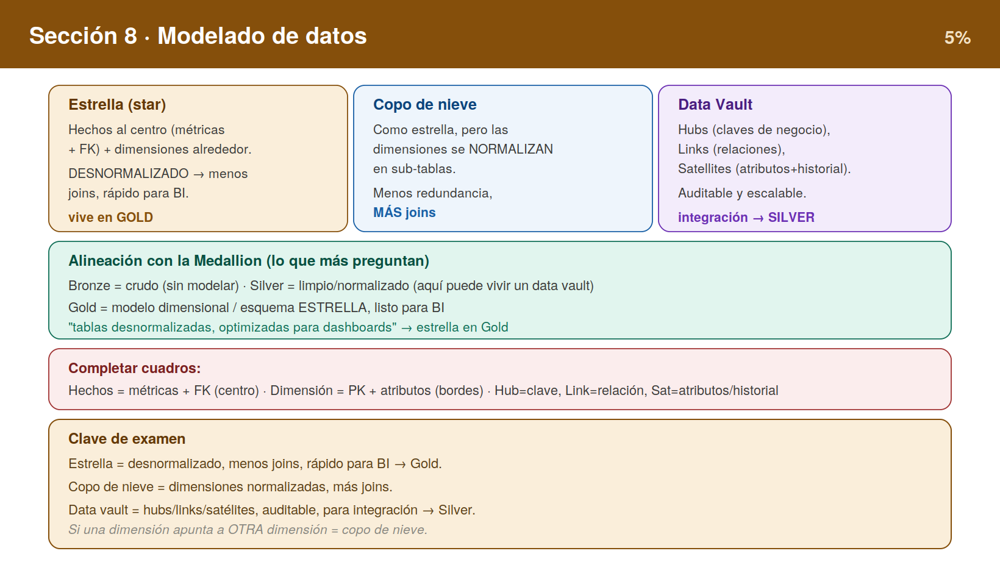


## Section 9: Securing Data 
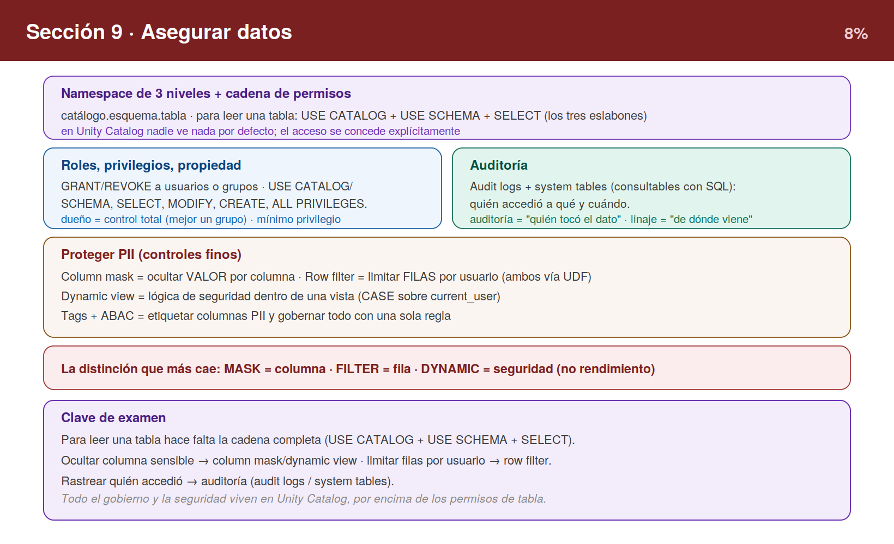

# Ejemplos de código - SQL

1️⃣ SELECT     ← Qué columnas quieres
2️⃣ FROM       ← De qué tabla
3️⃣ WHERE      ← Filtrado de filas (donde severity > 3)
4️⃣ GROUP BY   ← Agrupación (si aplica)
(puede aquí vaya luego HAVING)
5️⃣ ORDER BY   ← Ordenamiento (por qué columna)
6️⃣ LIMIT      ← Cuántos registros

INCORRECTO:
WHERE severity > 3 ORDER BY DESC LIMIT 5
↑ Falta SELECT, FROM, y falta columna en ORDER BY

CORRECTO:
SELECT * FROM complaints 
WHERE severity > 3 
ORDER BY created_at DESC 
LIMIT 5
↑ Sigue el orden exacto

SIN GROUP BY → Te da 1 sola fila con el promedio TOTAL
CON GROUP BY → Te da 1 fila POR AGENTE

┌───────────────────────────────
│ Sin GROUP BY (INCORRECTO)            
├───────────────────────────────
│ agent_id | AVG(resolution_hours)     
│ NULL     | 12.5  ← Promedio de TODOS 
└───────────────────────────────

┌───────────────────────────────
│ Con GROUP BY (CORRECTO)              
├───────────────────────────────
│ agent_id | AVG(resolution_hours)     
│ Agent_1  | 8.2   ← Solo Agent_1      
│ Agent_2  | 15.3  ← Solo Agent_2      
│ Agent_3  | 10.1  ← Solo Agent_3      
└───────────────────────────────


NOTA: DESC serán los datos más recientes

**Idempotent -> COPY INTO**
```sql
COPY INTO my_catalog.my_schema.orders 
FROM 's3://vendor-bucket/orders/'
FILEFORMAT = JSON;
```

-- Con COPY INTO Databricks automáticamente:
-- 1. Rastrrea qué archivos ya fueron cargados
-- 2. La siguiente ejecución solo carga archivos NUEVOS
-- 3. No duplica datos (idempotente)
-- 4. Se puede ejecutar en loop de Jobs sin problemas

**Merge**

-- MERGE INTO requiere:
-- - Una tabla de referencia para el JOIN
-- - Comparación de claves (ON condition)
-- - Es para UPDATE/INSERT basado en matching, NO para carga de archivos

```sql
MERGE INTO catalog.schema.orders USING 's3://vendor-bucket/orders/' ON 1=1
```
   ↑ Esto es sintaxis incorrecta para carga de archivos
   ↑ El ON 1=1 es un "truco" para forzar, pero no es idiomático


```sql
-- Tag de columna (PII). DBR 13.3+. Solo esta forma es válida:
ALTER TABLE customers ALTER COLUMN phone_number SET TAGS ('pii' = 'phone');

-- Time travel:
SELECT * FROM ventas TIMESTAMP AS OF '2026-04-15 09:00:00';  -- por fecha/hora
SELECT * FROM ventas VERSION AS OF 12;                        -- por versión (entero)
DESCRIBE HISTORY ventas;                                      -- ver versiones

-- COPY INTO (carga incremental, solo archivos nuevos):
COPY INTO catalog.schema.orders
FROM 's3://bucket/orders/'
FILEFORMAT = JSON;

-- Liquid Clustering:
CREATE TABLE ventas (...) CLUSTER BY (region, fecha);
OPTIMIZE ventas;
```


```sql
// Auto Loader (streaming incremental con schema evolution):
spark.readStream.format("cloudFiles")
  .option("cloudFiles.format", "json")
  .load(rutaCruda)
  ```

> Las trampas de sintaxis que ponen como distractores: BEFORE / AT TIME (no existen para time travel), PARTITIONED BY o ZORDER en lugar de CLUSTER BY, y GRANT TAG / SET COLUMN_TAGS para tags (inventados). La forma válida es la única correcta; las demás son sintaxis casi-creíble.

## Agregación y nulos
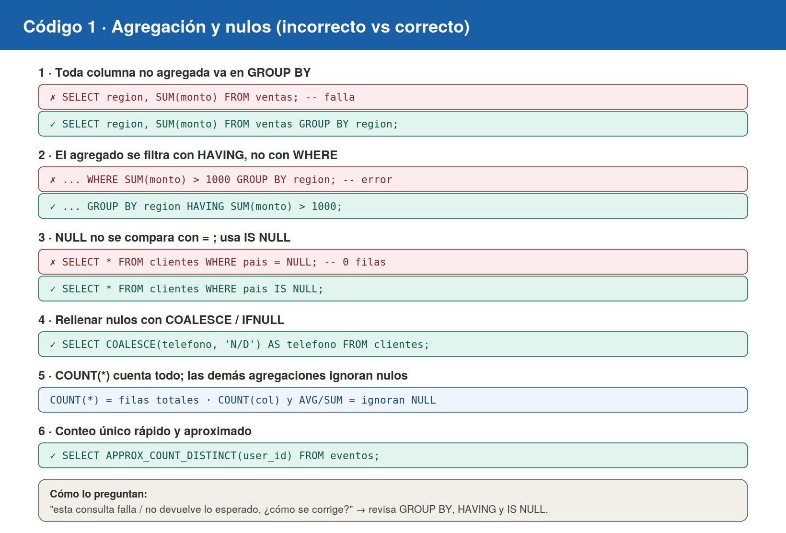

## Joins, conjuntos, dedup y cast
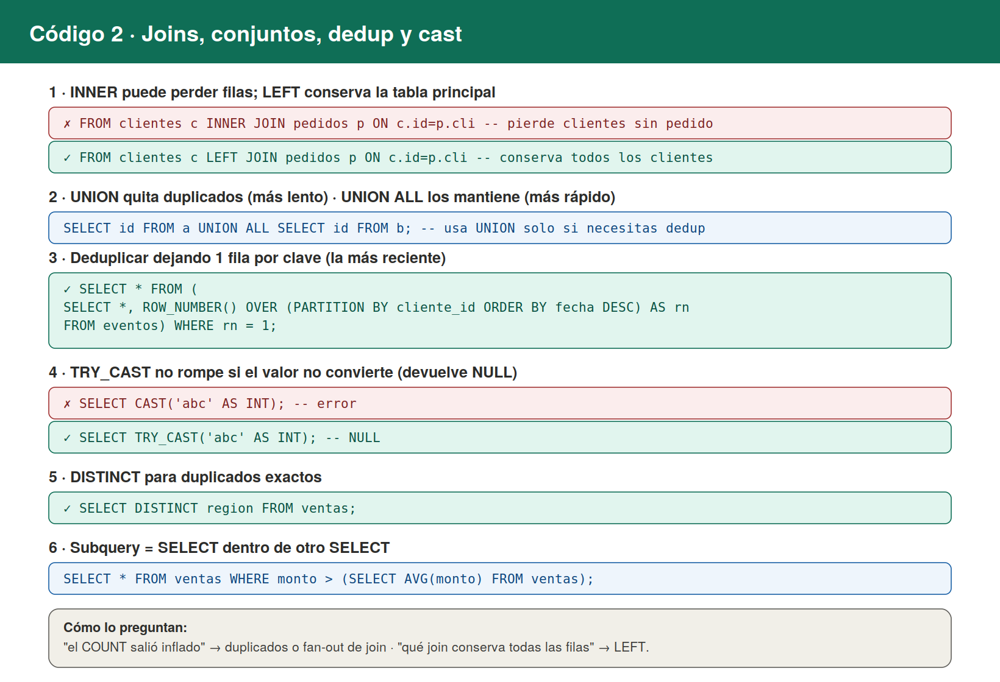

## Ingesta y tablas
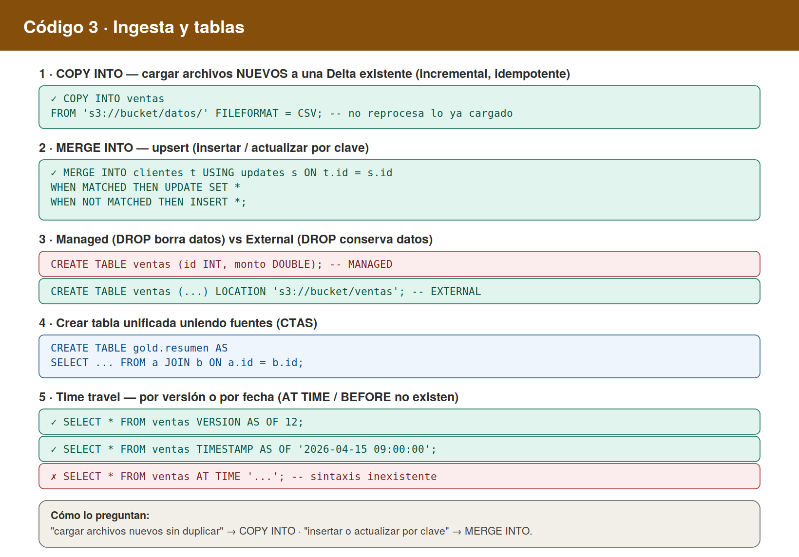

## Vistas, parámetros, permisos y PII
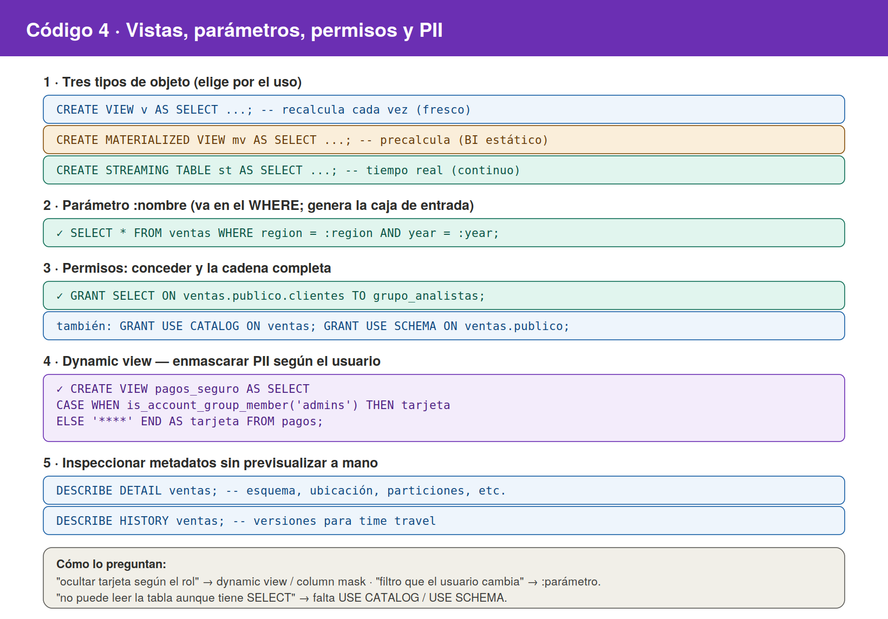

